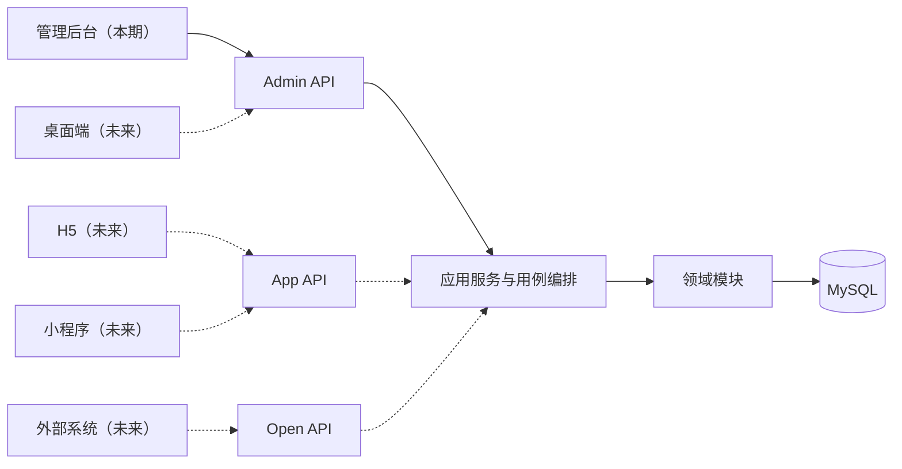

# 架构理念与总体原则

## 1. 设计目标

系统首先服务于管理后台的可靠交付，同时为未来 H5、小程序、桌面端和开放接口保留合理扩展路径。

架构需要同时满足：

- 个人开发者能够理解、开发、测试、部署和排障。
- 业务增长时可以增加模块，而不是持续扩大一个无边界的代码集合。
- 多终端共享业务能力，但不强迫不同终端共享页面和交互。
- 当前保持较低运维复杂度，未来按真实证据演进。
- AI 可以辅助生成代码，但架构边界、业务规则和验收责任仍然明确。

## 2. 核心理念

### 2.1 先模块化代码，再拆分部署

当前采用模块化单体：代码按业务边界隔离，运行时仍是一个后端应用和一个主要数据库。

```text
代码边界：独立
构建边界：当前统一
部署边界：当前统一
数据所有权：按模块明确
```

独立部署不是模块化的前提。只有出现独立扩容、独立发布、团队自治或故障隔离等真实需求时，才评估拆分服务。

### 2.2 业务能力与终端表现分离

管理后台、H5、小程序和桌面端可以调用相同的业务用例，但它们的信息密度、导航方式和交互流程不同。

因此：

- 后端业务规则不依赖具体终端。
- 不同终端可以拥有不同的接口响应模型。
- 跨端优先共享类型、协议和无界面规则，不强行共享页面。

### 2.3 主包负责装配，子包负责能力

前端主包负责应用启动、路由、身份、权限、布局和错误处理，不承担具体业务判断。

业务子包内部拥有自己的页面、状态、接口适配和测试，并通过明确入口向应用暴露能力。

### 2.4 数据有唯一所有者

每张业务表必须有明确所属模块。其他模块不能直接修改该表，也不能绕过模块公开接口调用其 Repository、Mapper 或内部实体。

共享数据库不等于共享数据所有权。

### 2.5 安全边界始终在后端

前端隐藏菜单和按钮只改善体验，不能构成安全控制。后端必须独立验证：

- 当前用户身份。
- 当前系统或租户是否启用目标模块。
- 用户是否具有所需能力。
- 用户是否有权操作目标数据。
- 当前业务状态是否允许该操作。

### 2.6 复杂度按真实需求引入

当前不提前引入微服务、微前端、动态插件、消息队列、多数据库和独立 BFF。

架构允许未来增加这些能力，但只有明确问题、收益和运维能力时才实施。

## 3. 系统上下文



虚线部分表示演进方向，不属于本期交付范围。

## 4. 架构质量属性

架构设计优先保护以下属性：

1. **可理解性**：通过一致目录、术语和调用方向降低认知成本。
2. **可测试性**：业务规则可以脱离 HTTP 和数据库做单元测试，数据库行为通过真实 MySQL 验证。
3. **可演进性**：模块具有明确公开接口和数据所有权。
4. **可运维性**：部署单元少，日志、迁移、备份和排障路径明确。
5. **安全性**：认证、授权、数据权限和业务状态在后端形成完整校验链。
6. **契约稳定性**：前后端通过 OpenAPI 和稳定错误模型协作。

## 5. 当前边界

本架构基线没有决定：

- 系统具体服务哪些用户和业务。
- 最终有哪些业务模块。
- 是否需要多租户。
- 具体登录方式和身份提供方。
- MyBatis 与 JPA 的最终选择。
- H5、小程序和桌面端的具体框架。
- 是否需要 Redis、Outbox、消息队列或搜索引擎。

这些事项必须由真实需求和非功能指标驱动。
