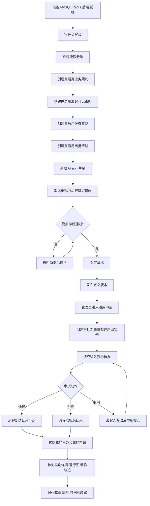
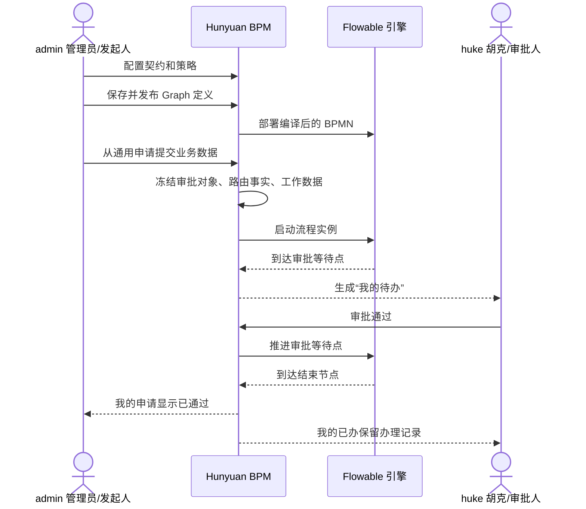
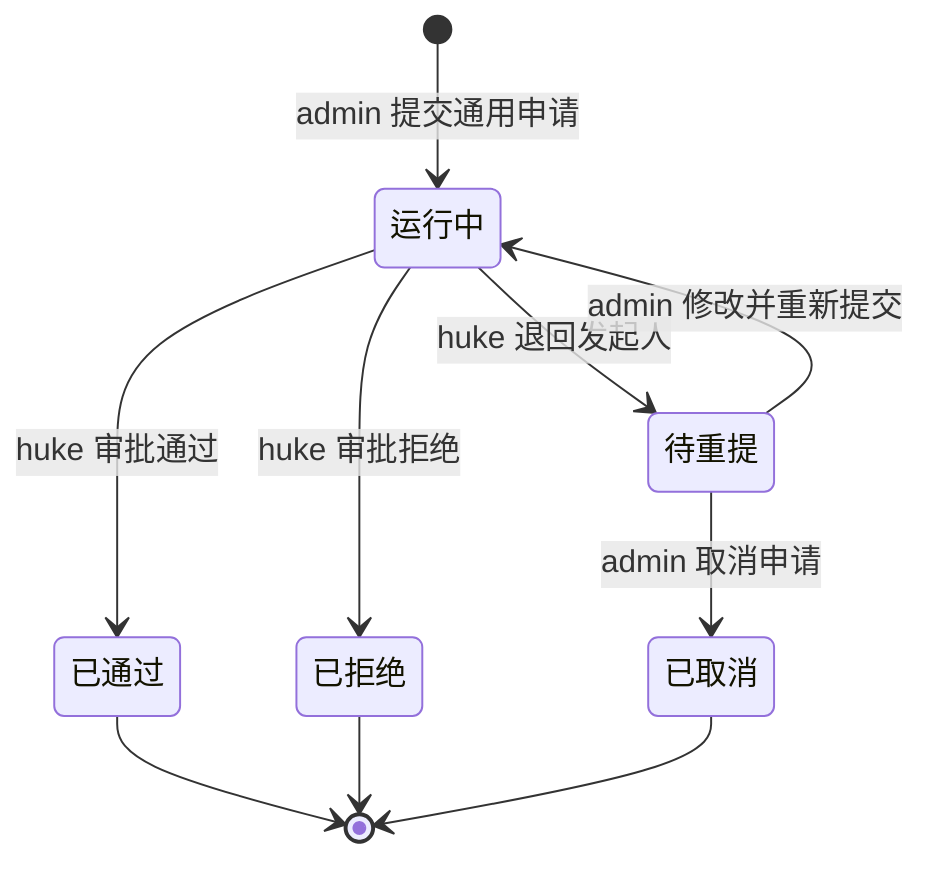

# Hunyuan Pro 流程引擎前端菜单端到端闭环操作指南

- 适用基线：`BPM-M1-M8-R1`
- 适用分支：`main`
- 编写日期：2026-07-14
- 验证目标：不依赖阅读代码，严格按照当前前端菜单完成一次可解释、可留证的 Graph 流程配置、发布、发起、审批、终态核对和管理端追踪

## 1. 先说结论：应该验证哪条主链

当前正式流程主链是：

```text
策略与业务契约 -> Graph 流程设计 -> 发布不可变版本 -> 通用申请
-> 创建审批对象快照 -> 启动 Flowable 实例 -> 审批人处理
-> 实例结束 -> 我的申请/已办/详情/运营审计留证
```

第一次验证只做一个最小流程：

```text
开始 -> 审批（胡克） -> 结束
```

不要第一次就加入条件网关、并行网关、延迟、外部调用、子流程或迁移。先证明最小主链能够闭环，再逐项验证高级能力。

> 重要：完整的新实例发起推荐从“通用申请”进入。该入口会创建后端要求的审批对象、路由事实和工作数据快照。当前“可发起流程 -> 发起”页面可以用于检查定义是否对当前用户可见，但页面没有提供审批对象快照的创建或选择控件，全新实例直接提交可能返回“Graph 流程发起必须提供审批对象快照”。这不是验证人员填写错误。

### 1.1 先看这一条：按当前菜单真正走通的顺序

前端菜单的显示顺序不是业务依赖顺序。不要从上到下把每个菜单都操作一遍；最小闭环应按下面的顺序执行：

```text
admin 登录
  1. 流程分类：准备一个启用分类
  2. 流程表单：本次跳过
  3. 向下滚动到业务契约目录：创建并启用业务契约
  4. 向下滚动到审批策略目录：创建并启用发起、候选、审批三类策略
  5. Graph 流程设计：创建“开始 -> 胡克审批 -> 结束”，绑定分类、契约和三类策略后发布
  6. 可发起流程：只确认新发布 Graph 对 admin 可见，不从这里提交
  7. 通用申请：填写业务键、标题和 reason，真正创建实例
  8. 我的申请：记录实例编号，确认状态为流转中
  9. 流程实例：管理员确认实例投影为运行中
 10. 流程任务：管理员确认待办处理人是胡克

huke 登录
 11. 我的待办：打开同一实例，审批通过并可选抄送 admin
 12. 我的已办：确认办理结果为通过

admin 重新登录
 13. 我的申请：确认实例已结束、结果为通过
 14. 流程实例：确认管理端终态也是已结束/通过
 15. 流程任务：确认任务已完成、结果为通过、处理人是胡克
 16. 我的抄送：只有第 11 步选择了 admin 时才检查
```

最终必须形成同一个业务编号的六处一致证据：

| 证据位置 | 必须看到的结果 |
| --- | --- |
| Graph 流程设计 | 定义版本已发布，存在引擎定义 ID |
| admin / 我的申请 | 同一实例先“流转中”，后“已结束/通过” |
| huke / 我的待办 | 审批前存在待办，审批后消失 |
| huke / 我的已办 | 同一任务结果为通过 |
| admin / 流程实例 | 同一实例为已结束/通过，无当前待办 |
| admin / 流程任务 | 同一任务为已完成/通过，处理人为胡克 |

只要其中一处编号、状态、处理人或结果不一致，就不能称为闭环。

### 1.2 截图中每个菜单到底做什么

| 当前菜单 | 本次是否操作 | 使用账号 | 在闭环中的作用 |
| --- | --- | --- | --- |
| 流程分类 | 必须 | admin | 为 Graph 提供有效分类；分类必须启用 |
| 流程表单 | 跳过 | admin | 独立表单目录；当前最小 Graph 主链由“业务契约 + 通用申请”生成字段，Graph 设计器不绑定此菜单中的表单 |
| Graph 流程设计 | 必须 | admin | 建模、绑定契约/策略、模拟、保存和发布不可变版本 |
| 流程实例 | 必须核对 | admin | 管理端查看所有实例状态、发起人、时间和运行详情，不用于员工发起 |
| 流程任务 | 必须核对 | admin | 管理端查看任务处理人、状态、结果和审批组，不用于胡克正常审批 |
| 流程监听器 | 最小闭环跳过 | admin | 查询监听器/通知渠道目录；只有流程显式使用监听或通知能力时才验证 |
| 可发起流程 | 只检查可见性 | admin | 证明发布版本和发起策略生效；当前 Graph 新实例不要从这里直接提交 |
| 我的申请 | 必须 | admin | 发起人查看运行中、待重提、已结束和已取消实例 |
| 我的待办 | 必须 | huke | 真正执行通过、拒绝或退回动作的员工工作台 |
| 我的已办 | 必须 | huke | 证明任务动作已经完成并形成办理记录 |
| 我的抄送 | 条件执行 | 被抄送账号 | 证明抄送记录和已读状态；抄送人不能获得审批权限 |
| 审批策略目录 | 必须 | admin | 创建发起范围、候选人和审批完成规则；菜单在截图可视区域下方 |
| 业务契约目录 | 必须 | admin | 定义业务键、审批对象字段、路由事实和工作数据；菜单在截图可视区域下方 |
| 通用申请 | 必须 | admin | 创建审批对象快照并启动正式 Graph 实例；菜单在截图可视区域下方 |

截图右侧滚动条说明“流程引擎”菜单还没有滚到底。请继续向下滚动，必须找到“审批策略目录”“业务契约目录”和“通用申请”。如果 admin 看不到这三个菜单，不要从“可发起流程”硬走：先确认数据库至少执行到 `v3.61.0.sql`，然后检查 admin 的菜单授权并重新登录。缺少这三个入口时，本指南的正式 Graph 闭环不具备前置条件。

## 2. 用通俗的话理解这套引擎

可以把流程引擎理解成四层：

| 层次 | 作用 | 你在页面上看到的内容 |
| --- | --- | --- |
| 规则层 | 决定谁能发起、谁来审批、几个人通过才算通过 | 审批策略目录、业务契约目录 |
| 设计层 | 把开始、审批、条件、结束等节点连成流程 | Graph 流程设计 |
| 运行层 | 真正创建流程实例和待办，推进节点 | 通用申请、我的待办、我的申请 |
| 治理层 | 查看异常、审计、指标和迁移影响 | 运营治理、迁移与演进 |

Flowable 负责底层流程实例和执行位置，Hunyuan BPM 负责人员、权限、业务数据快照、审批策略、任务动作、审计和恢复。验证时应以 Hunyuan 页面和接口返回的业务事实为准，不要直接修改 Flowable 表。

## 3. 完整验证流程图



### 3.1 两个账号之间如何流转



## 4. 验证前准备

### 4.1 环境要求

| 服务 | 默认地址 | 最低检查 |
| --- | --- | --- |
| MySQL | `127.0.0.1:3306/hunyuan` | 数据库可连接，增量 SQL 已执行到 `v3.61.0.sql` |
| Redis | `127.0.0.1:6379` | 端口可连接 |
| 后端 | `http://127.0.0.1:1024` | `/login/getCaptcha` 返回 HTTP 200 |
| 前端 | 默认 `http://127.0.0.1:5788` | `@hunyuan/system` 登录页可打开；若显式覆盖端口，以终端实际输出为准 |

PowerShell 端口检查：

```powershell
Test-NetConnection 127.0.0.1 -Port 3306
Test-NetConnection 127.0.0.1 -Port 6379
Test-NetConnection 127.0.0.1 -Port 1024
```

后端健康检查：

```powershell
Invoke-WebRequest http://127.0.0.1:1024/login/getCaptcha -UseBasicParsing
```

### 4.2 启动命令

后端：

```powershell
cd E:\my-project\hunyuan-pro\hunyuan-backend
mvn clean install -DskipTests
cd hunyuan-admin
mvn spring-boot:run
```

前端另开一个 PowerShell：

```powershell
cd E:\my-project\hunyuan-pro\hunyuan-design
pnpm install
pnpm --filter @hunyuan/system dev
```

不要使用仓库根脚本 `pnpm dev` 代替最后一条命令：该脚本启动的是 `@vben/web-ele`，不是本指南需要验证的 `@hunyuan/system`。如果仓库依赖已经安装、后端已经打包，可以复用现有进程，不必每次重新安装。

### 4.3 验证账号

本地初始化环境通常使用：

| 账号 | 本指南中的角色 | 本地开发密码 |
| --- | --- | --- |
| `admin` | 管理员、流程发起人 | `123456` |
| `huke` | 胡克、审批人 | `123456` |

密码以当前环境实际配置为准。`huke` 应绑定 `bpm_runtime_user` 角色。修改角色或菜单后必须退出并重新登录；权限缓存未刷新时重启后端。

建议使用两个互不共享登录状态的浏览器窗口：

- 普通窗口登录 `admin`，用于配置、发起和管理端核对。
- 无痕窗口登录 `huke`，用于接收并处理待办。

这样不需要在同一个窗口反复退出登录，也不容易把 admin 和 huke 的页面证据混在一起。不要用脚本或第三个窗口重复登录同一账号；当前认证策略下，额外登录可能使已经打开的浏览器会话失效。每张截图都应包含能识别当前账号或角色的页面区域。

### 4.4 菜单检查

管理员至少应能看到：

- 流程分类
- Graph 流程设计
- 审批策略目录
- 业务契约目录
- 通用申请
- 可发起流程
- 我的申请
- 我的待办
- 我的已办
- 我的抄送
- 运营治理
- 迁移与演进

`huke` 至少应能看到已授权的运行端菜单：可发起流程、我的申请、我的待办、我的已办、我的抄送。本指南只要求 `admin` 使用“通用申请”；现有增量 SQL 默认没有把该菜单授权给 `bpm_runtime_user`。若应有的菜单不可见，先处理权限，不要继续做业务验证。

### 4.5 先建立自动化基线

手工主链用于证明真实业务闭环，自动化门禁用于排除编译、契约、状态机和 Flowable 兼容回归。两者不能互相替代。

日常或功能验收至少执行：

```powershell
cd E:\my-project\hunyuan-pro\hunyuan-backend
mvn -pl hunyuan-bpm -am test

cd E:\my-project\hunyuan-pro\hunyuan-design
pnpm test:unit -- apps/hunyuan-system/src/api/system/bpm apps/hunyuan-system/src/components/bpm apps/hunyuan-system/src/views/system/bpm apps/hunyuan-system/src/router/bpm-designer-layout.test.ts
pnpm --filter @hunyuan/system typecheck
```

发布验收还应在已迁移的测试库上执行真实 Flowable/MySQL 门禁：

```powershell
cd E:\my-project\hunyuan-pro\hunyuan-backend
mvn --% -pl hunyuan-admin -am -Dtest=BpmFlowableCompatibilityTest -Dsurefire.failIfNoSpecifiedTests=false test
mvn --% -pl hunyuan-admin -am -Dtest=BpmM8LiveMigrationAcceptanceTest -Dm8.live=true -Dsurefire.failIfNoSpecifiedTests=false test
```

通过标准：所有命令退出码为 0，Maven 显示 `BUILD SUCCESS`，测试没有失败或错误；M8 实库类必须实际执行，不能把“条件未满足而跳过”记为通过。若本轮只做核心审批主链，M8 门禁可以标记为“本轮不适用”，但不能据此声明整个平台可发布。

### 4.6 测试数据复用与唯一性

- 首次执行时创建本指南中的契约、策略和 Graph；再次执行时，只有内容和状态完全一致才复用现有 `ACTIVE` 版本。
- 配置内容发生变化时使用“复制为草稿”形成新版本，不原地修改已启用策略、契约或已发布 Graph。
- 每个新实例必须使用未出现过的业务键，例如 `MV-20260714-0001`、`MV-20260714-0002`；重复业务键被拒绝是正确的数据完整性行为。
- 在验收记录中写明实际使用的契约版本、三个策略版本、Graph 版本和业务键，不能只记录显示名称。

### 4.7 第一个菜单动作：准备流程分类

使用 `admin` 进入“流程分类”，先搜索分类编码 `manual_verify`：

- 如果已经存在且状态为“启用”，直接复用并记录分类名称。
- 如果存在但状态为“禁用”，点击“编辑”，关闭“禁用状态”后保存。
- 如果不存在，点击“新增分类”，按下表填写。

| 字段 | 填写值 |
| --- | --- |
| 分类编码 | `manual_verify` |
| 分类名称 | `手工验证流程` |
| 图标 | `ep:connection` |
| 排序 | `100` |
| 禁用状态 | 关闭，即启用 |
| 备注 | `流程引擎端到端手工闭环验证` |

点击“保存”，回到列表后重新搜索 `manual_verify`，确认状态为“启用”。随后打开“流程表单”确认页面能正常加载，但本轮不新增表单，直接进入第 5 节。当前正式 Graph 主链使用业务契约生成申请字段，不从“流程表单”读取本轮数据。

## 5. 第一步：准备最小业务契约

使用 `admin` 登录，进入“业务契约目录”，点击“新增契约草稿”。

建议填写：

- 契约编码：`manual_verify_contract`
- Schema：`1`
- 契约 JSON：

```json
{
  "sourceSystem": "HUNYUAN",
  "businessType": "MANUAL_VERIFY",
  "businessKeyRule": {
    "pattern": "MV-[0-9]{8}-[0-9]{4}"
  },
  "fieldSchema": [
    {
      "key": "reason",
      "type": "STRING",
      "required": true,
      "sensitivity": "INTERNAL"
    }
  ],
  "routingFacts": [],
  "workingDataSchema": [],
  "attachmentRules": {
    "maxCount": 0
  },
  "detailLayout": {
    "sections": ["fields"]
  },
  "changePolicy": {
    "mode": "LOCKED"
  }
}
```

操作顺序：

1. 点击“校验”。
2. 看到“业务契约校验通过”。
3. 点击“创建草稿”。
4. 在列表中找到 `manual_verify_contract v1`。
5. 点击“启用”，确认状态变为 `ACTIVE`。

通过标准：契约能在“通用申请”的业务契约下拉框中出现。

## 6. 第二步：准备三个策略

进入“审批策略目录”。每个策略都按“新增策略草稿 -> 校验 -> 创建草稿 -> 启用”的顺序操作。

### 6.1 发起可见策略

- 类型：发起可见范围
- 策略编码：`manual_verify_start_admin`

```json
{
  "startScope": {
    "type": "EMPLOYEE_IDS",
    "employeeIds": [1]
  },
  "visibilityScope": {
    "type": "EMPLOYEE_IDS",
    "employeeIds": [1, 2]
  },
  "riskLevel": "LOW"
}
```

含义：员工 ID 1 的 `admin` 可以发起，`admin` 和员工 ID 2 的 `huke` 可以看到相关范围。

### 6.2 候选策略

- 类型：候选策略
- 策略编码：`manual_verify_candidate_huke`

```json
{
  "resolverType": "EMPLOYEE",
  "resolverParameters": {
    "employeeIds": [2]
  },
  "resolutionPhase": "ACTIVATE",
  "memberOrder": "EMPLOYEE_ID",
  "duplicateRule": "SOURCE_EMPLOYEE",
  "emptyCandidatePolicy": "BLOCK",
  "selfApprovalPolicy": "BLOCK",
  "riskLevel": "LOW"
}
```

含义：审批节点固定由员工 ID 2 的 `huke` 处理；候选人为空或发起人给自己审批时直接阻断。

### 6.3 审批策略

- 类型：审批策略
- 策略编码：`manual_verify_approval_all`

```json
{
  "completionMode": "ALL",
  "ratioPercent": 100,
  "rejectionRule": "IMMEDIATE",
  "allowedActions": ["APPROVE", "REJECT", "RETURN"],
  "returnRule": "RETURN_INITIATOR",
  "terminationRule": "CANCEL_REMAINING_MEMBERS",
  "riskLevel": "LOW"
}
```

含义：所有有效审批人都通过才算通过；任何人拒绝立即拒绝；允许退回发起人。

通过标准：三个策略都显示 `ACTIVE`。Graph 设计器只会列出已启用版本。

## 7. 第三步：创建最小 Graph 流程

### 7.1 先准备流程分类

回到“流程分类”，确认第 4.7 节准备的 `manual_verify / 手工验证流程` 仍为“启用”。Graph 草稿必须绑定有效分类，否则即使发布成功，也不会出现在可发起列表中。

Graph 设计器当前填写的是数字“分类 ID”。如果列表没有直接展示 ID，可以打开浏览器开发者工具：

1. 按 `F12`，进入 Network。
2. 刷新“流程分类”页面。
3. 找到分类分页请求。
4. 在响应列表中查看 `categoryId`。

也可以复用当前环境已知的有效分类 ID，但不要照抄其他环境的 ID。

### 7.2 创建草稿

进入“Graph 流程设计”，点击“新建流程”，填写：

- 流程编码：`manual_verify_flow_20260714`
- 流程名称：`手工验证审批流程`
- 分类 ID：填写上一步查到的有效分类 ID

点击“创建 Graph 草稿”。新草稿默认只有“开始 -> 结束”。

### 7.3 加入审批节点

1. 在左侧节点栏点击“审批”。
2. 设计器会自动把审批节点插入结束节点之前。
3. 选中审批节点，把显示名称改为“胡克审批”。
4. 候选策略选择 `manual_verify_candidate_huke v1`。
5. 审批策略选择 `manual_verify_approval_all v1`。
6. SLA 到期时长可以暂时留空，超时动作保持“仅提醒”。

### 7.4 绑定流程级依赖

在右侧“流程契约”填写：

- 业务契约：`manual_verify_contract`
- 契约版本：`1`
- 发起可见策略：`manual_verify_start_admin v1`

此时画布应该是：


### 7.5 模拟、保存和发布

1. 查看页面顶部状态。
2. 如果显示“发布阻断项”，点击右侧具体诊断并逐项修正。
3. 直到顶部和右侧都显示“模拟通过”。
4. 点击“保存草稿”。
5. 确认状态变为“语义已保存”。
6. 点击“发布定义”。
7. 发布成功后打开版本详情。

版本详情至少应满足：

- 生命周期为“已发布”。
- 存在 Flowable 引擎定义 ID。
- 编译 BPMN 不为空。
- 元素映射包含开始、审批、结束节点。
- 冻结信息中有语义哈希和依赖版本。

## 8. 第四步：发起完整流程

保持 `admin` 登录，进入“通用申请”。

填写：

| 字段 | 示例值 |
| --- | --- |
| 流程定义 | `手工验证审批流程 v1` |
| 业务契约 | `manual_verify_contract v1` |
| 业务键 | `MV-20260714-0001` |
| 审批标题 | `2026-07-14 手工验证申请` |
| 审批摘要 | `验证 Graph 发布、快照、待办和审批闭环` |
| 审批对象字段 reason | `验证流程引擎主链` |
| 明细 JSON | `[]` |
| 附件 JSON | `[]` |

点击“提交申请”。

预期结果：

1. 页面提示“申请已发起，实例 xxx”。
2. 自动跳转到“我的申请”。
3. 新记录状态为运行中，当前节点为“胡克审批”或同等含义。
4. 打开详情能看到审批对象摘要、当前任务、动作轨迹和运行图。

立即记录：

- 实例 ID
- 实例编号
- Graph 定义版本
- 发起时间
- 发起账号

### 8.1 审批前先查“流程实例”

不要立刻切换到 `huke`。先用 `admin` 打开“流程实例”：

1. 在“实例编号”中粘贴刚记录的实例编号。
2. 点击“查询”。
3. 确认只命中本轮实例。
4. 运行状态应为“运行中”。
5. 结果状态应为空、处理中或尚未形成终态，不能已经显示通过。
6. 发起人应为管理员，标题和发起时间应与“我的申请”一致。
7. 打开“详情”，运行图应高亮“胡克审批”，当前任务应存在。

### 8.2 审批前再查“流程任务”

继续用 `admin` 打开“流程任务”：

1. 按同一实例编号查询。
2. 找到任务名称“胡克审批”。
3. 任务状态应为“待处理”。
4. 当前处理人应为胡克。
5. 到达时间应晚于或等于实例发起时间。
6. 打开详情，记录任务 ID 或任务标识。

如果实例已创建但没有任务，或任务处理人不是胡克，不要继续审批。回到 Graph 版本详情检查冻结的候选策略是否为 `manual_verify_candidate_huke`，并确认该策略中的 `employeeIds` 为 `[2]`、`huke` 员工未禁用。

## 9. 第五步：审批人处理待办

### 9.1 切换账号

1. `admin` 正常退出。
2. 使用 `huke / 123456` 登录。
3. 进入“我的待办”。

预期结果：能看到标题为“2026-07-14 手工验证申请”的待办，任务名称为“胡克审批”。

### 9.2 查看详情

点击“详情”，检查：

- 实例编号与 `admin` 看到的一致。
- 发起人为管理员。
- 当前任务属于胡克。
- 可用动作由服务端返回，至少包含通过、拒绝、退回。
- 流程图当前高亮在审批节点。

### 9.3 审批通过

1. 点击“审批通过”。
2. 审批意见填写：`手工验证通过`。
3. 如需同时验证抄送，可选择 `admin` 为抄送人。
4. 确认提交。

预期结果：

- 页面提示“审批已通过”。
- 该记录从“我的待办”消失。
- “我的已办”出现对应记录，结果为通过。
- 详情动作轨迹增加“审批通过”。

## 10. 第六步：确认流程真正结束

退出 `huke`，重新登录 `admin`，进入“我的申请”。

检查该实例：

| 检查项 | 正确结果 |
| --- | --- |
| 运行状态 | 已结束 |
| 结果状态 | 通过 |
| 当前待办 | 无 |
| 运行图 | 开始、审批、结束均已走过 |
| 动作轨迹 | 至少包含发起和审批通过 |
| 审批人 | 胡克 |
| 标题/业务键 | 与发起时一致 |

如果审批时选择了抄送人，再进入“我的抄送”，检查抄送记录、未读状态和详情；打开后应能形成已读状态。

### 10.1 用“流程实例”做管理员对账

保持 `admin` 登录，进入“流程实例”：

1. 在“实例编号”输入第 8 节记录的实例编号。
2. 点击“查询”。
3. 列表应只出现目标实例；不要只按标题判断，因为重复验收可能使用相同标题。
4. 确认运行状态为“已结束”，结果为“通过”。
5. 确认发起人为管理员，发起时间与本轮一致。
6. 点击“详情”，核对当前任务为空、运行图已到结束节点、动作轨迹包含发起和胡克审批通过。

管理端“流程实例”和员工端“我的申请”必须指向同一实例编号，并显示相同终态。若一个显示运行中、另一个显示已结束，先刷新两页；刷新后仍不一致即为投影或推进故障，本轮判定失败。

### 10.2 用“流程任务”做管理员对账

进入“流程任务”：

1. 在“实例编号”输入同一实例编号。
2. 点击“查询”。
3. 找到任务名称“胡克审批”或设计时填写的同等名称。
4. 确认任务状态为“已完成”。
5. 确认任务结果为“审批通过”。
6. 确认当前处理人或最终处理人为胡克。
7. 点击“详情”，核对任务标识、到达时间、完成时间和审批组事实。

“流程任务”是管理员查询和治理页面；正常审批必须由 `huke` 在“我的待办”完成。不要为了让测试通过而在管理端转办、委派或直接修改任务。

### 10.3 如果本轮验证了抄送

若 `huke` 审批时选择了 `admin`：

1. `admin` 进入“我的抄送”。
2. 按实例编号或标题查询。
3. 确认抄送类型为“审批通过抄送”，初始状态为未读。
4. 点击“详情”，确认实例编号和审批结果正确。
5. 返回列表或刷新，确认记录变为已读。
6. 确认该页面没有通过、拒绝、退回等审批按钮。

如果审批时没有选择抄送人，“我的抄送”没有记录是正确结果，应在验收记录中写“本轮未选择抄送”，不能记为失败。

## 11. 通过、拒绝、退回三条分支图



主链通过后，建议再创建两个新实例：

### 11.1 拒绝验证

- 业务键：`MV-20260714-0002`
- `huke` 选择“审批拒绝”
- 意见：`验证拒绝终态`
- 预期：实例结束，结果为拒绝，不再产生待办

### 11.2 退回重提验证

- 业务键：`MV-20260714-0003`
- `huke` 选择“退回发起人”
- 意见：`请补充验证说明`
- 预期：实例进入待重提，其他当前待办被关闭
- `admin` 在“我的申请”进入重新提交页，修改标题或摘要后重提
- 预期：实例重新进入运行中，`huke` 再次收到待办，动作轨迹包含退回和重新提交

## 12. 建议追加的异常验证

这些测试不要求第一次全部执行，但发布前应按风险选择。

### 12.1 权限和可见范围

使用不在 `manual_verify_start_admin` 发起范围内的普通账号登录：

- “可发起流程”不应显示该定义。
- 直接访问发起接口也应被服务端拒绝。
- 不能只依赖前端隐藏按钮。

### 12.2 自审批阻断

把候选策略复制成新版本，并临时把 `employeeIds` 改成 `[1]`，同时保持 `selfApprovalPolicy=BLOCK`。发布新的 Graph 版本后由 `admin` 发起。

预期：候选解析或审批阶段激活被阻断，不应静默让发起人给自己审批。测试完成后不要把该版本作为正式版本使用。

### 12.3 任务并发版本冲突

1. 使用同一审批账号打开两个浏览器标签页。
2. 两边同时打开同一待办详情。
3. 第一个标签页审批通过。
4. 第二个标签页再次提交。

预期：第二次提交返回任务版本冲突或任务已处理，不应重复推进流程。

### 12.4 定义下线

1. 发布并成功发起一个实例。
2. 在 Graph 版本详情中下线该定义。
3. 刷新“可发起流程”和“通用申请”。

预期：新发起入口不再展示该版本，但已经运行的实例仍按冻结版本继续处理。

### 12.5 抄送

审批通过时选择抄送人：

- 抄送人能在“我的抄送”看到记录。
- 打开详情后已读状态变化。
- 抄送人不能因此获得审批动作。

### 12.6 管理员治理

在“运营治理”检查：

- 页面能正常查询、显示指标和导出入口。
- 没有异常工单时显示空态是正常结果。
- 只有真实失败事实才应生成工单，不要为了造数据直接修改数据库。
- 重试、补偿、终止和归档必须填写原因，并受独立权限控制。

### 12.7 迁移预演

只有存在同流程键的前向新版本时才验证迁移：

1. 复制或修改 Graph 草稿并发布 v2。
2. 保留一个 v1 运行实例。
3. 在“迁移与演进”选择源版本、目标版本和实例。
4. 先做“迁移预演”。

预期：页面明确列出合格实例和阻断原因。首次手工验收建议只做预演，不在重要实例上点击“确认迁移”。迁移成功后不能通过删平台表或改 Flowable 表物理回滚。

## 13. M1-M8 页面烟测矩阵

完整主链通过后，再用管理员逐页检查平台能力。

| 模块 | 页面 | 最低手工验证 |
| --- | --- | --- |
| M1 定义中心 | Graph 流程设计 | 草稿可保存、模拟可诊断、版本可发布、详情有 BPMN 和映射 |
| M2 审批策略 | 审批策略目录 | 三类策略可查询，草稿可校验，启用版本不可原地编辑 |
| M3 数据治理 | 业务契约目录、通用申请 | 契约可启用，申请按契约生成字段并创建快照 |
| M4 核心运行 | 待办、已办、我的申请、详情 | 发起、通过、拒绝、退回重提和轨迹闭环 |
| M5 高级运行 | 时间事件、外部等待、连接器相关页面 | 页面可查询；有测试数据时验证重试或取消 |
| M6 业务接入 | 配置化接入工作台 | 来源系统、应用、员工映射、流程绑定、订阅可查询 |
| M7 运营治理 | 运营治理 | 查询、指标、导出、处置审计和权限边界正常 |
| M8 迁移演进 | 迁移与演进 | Diff、影响实例、预演阻断和审计入口正常 |

页面能打开只能证明路由和权限可用，不能代替完整业务闭环。至少要有第 8 至第 10 节的一次真实实例证据。

## 14. 常见失败与判断方法

| 现象 | 最可能原因 | 处理方法 |
| --- | --- | --- |
| Graph 发布一直有阻断项 | 契约或策略未绑定、未启用，审批节点缺候选/审批策略 | 按模拟诊断逐项补齐；只选择 `ACTIVE` 版本 |
| 发布成功但可发起列表没有流程 | 分类 ID 为空/无效，发起可见策略不包含当前用户，版本已下线 | 检查分类快照、策略中的 employeeId 和版本状态 |
| 从“可发起流程”提交时报审批对象快照缺失 | 当前直接发起页面未创建审批对象快照 | 改从“通用申请”发起 |
| 通用申请看不到契约 | 契约仍是 `DRAFT` 或已退休 | 在业务契约目录启用版本 |
| 通用申请看不到 Graph | Graph 未发布、已下线或当前用户不在发起范围 | 检查发布详情和发起可见策略 |
| 提交申请提示业务键不合法 | 业务键不符合契约正则 | 本指南使用 `MV-YYYYMMDD-NNNN` |
| admin 发起后 huke 没有待办 | 候选策略员工 ID 不对、huke 被禁用、策略未冻结进发布版本 | 查看 Graph 版本冻结信息，确认候选策略为 employeeId 2 |
| huke 看不到运行端菜单 | 未绑定 `bpm_runtime_user` 或登录缓存未刷新 | 重新绑定角色，退出重登，必要时重启后端 |
| 按钮存在但接口返回 403/无权限 | 菜单权限、前端按钮权限和后端权限不一致 | 用 Network 确认失败接口，再检查角色菜单和权限字符串 |
| 第二次审批失败 | 任务已被处理或 `taskVersion` 过期 | 这是正确的并发保护，刷新列表即可 |
| 运营治理没有工单 | 当前没有结构化失败事实 | 空态正常，不要伪造数据库记录 |
| 迁移按钮禁用 | 预演存在活动人工任务、契约不兼容或其他阻断 | 阅读逐实例阻断原因，不要绕过预演 |
| 登录后偶发动态路由错误 | 登录信息、菜单映射或路由初始化未完成 | 刷新一次；若稳定复现，应标记阻断并排查，不应忽略 |

## 15. 浏览器取证方法

建议每个关键步骤同时保存三类证据：页面、网络、业务编号。

### 15.1 页面证据

至少截图：

1. Graph 模拟通过。
2. Graph 版本已发布。
3. `admin` 的我的申请运行中详情。
4. `huke` 的我的待办。
5. `huke` 审批后的我的已办。
6. `admin` 的最终已通过实例详情。

### 15.2 Network 证据

按 `F12` 打开 Network，勾选 Preserve log。关键动作完成后检查：

- HTTP 请求没有 401、403、404、500。
- 业务响应 `ok=true` 或等价成功状态。
- 失败分支返回的是预期业务错误，不是路由缺失或服务器异常。

不要把 token、Cookie、密码或完整敏感业务载荷提交到仓库。

### 15.3 业务证据

记录实例 ID、实例编号、定义版本、任务 ID、账号、动作、时间和最终状态。截图文件名建议使用：

```text
bpm-manual-01-graph-published.png
bpm-manual-02-admin-instance-running.png
bpm-manual-03-huke-todo.png
bpm-manual-04-huke-approved.png
bpm-manual-05-admin-instance-approved.png
```

截图和临时日志默认保存在仓库外，不要提交，除非明确要求将其作为长期发布证据。

## 16. 验收记录模板

```markdown
# BPM 手工验证记录

- 日期：
- 分支/提交：
- 后端地址：
- 前端地址：
- 数据库增量版本：
- 验证人员：

## 主链

| 检查项 | 结果 | 证据 |
| --- | --- | --- |
| 契约和三类策略已启用 | PASS/FAIL | 版本号或截图 |
| Graph 模拟通过并发布 | PASS/FAIL | Graph 版本 ID |
| 通用申请成功发起 | PASS/FAIL | 实例 ID/编号 |
| huke 收到待办 | PASS/FAIL | 任务 ID/截图 |
| huke 审批通过 | PASS/FAIL | 动作时间/截图 |
| admin 查看最终已通过 | PASS/FAIL | 实例详情截图 |
| 动作轨迹和运行图一致 | PASS/FAIL | 详情截图 |

## 异常分支

| 场景 | 结果 | 说明 |
| --- | --- | --- |
| 拒绝 | PASS/FAIL/未执行 | |
| 退回重提 | PASS/FAIL/未执行 | |
| 重复提交/版本冲突 | PASS/FAIL/未执行 | |
| 无权限账号发起 | PASS/FAIL/未执行 | |
| 定义下线 | PASS/FAIL/未执行 | |

## 结论

- 实现是否可运行：
- 主链是否闭环：
- 是否存在发布阻断：
- 未执行项和原因：
```

## 17. 最终通过标准

只有同时满足以下条件，才能称为“手工主链验证通过”：

1. Graph 草稿模拟通过并成功发布不可变版本。
2. 使用“通用申请”创建真实审批对象快照并启动实例。
3. 待办准确落到预期审批人，而不是发起人或无关人员。
4. 审批动作真正推进 Flowable，实例到达结束节点。
5. 我的待办、我的已办、我的申请和实例详情状态一致。
6. 运行图、当前任务、动作轨迹和最终结果相互一致。
7. 浏览器请求没有非预期 403、404、500。
8. 至少保存实例编号、定义版本、任务动作和最终详情证据。

如果只是页面能打开、列表能查询或自动化测试通过，不能单独替代上述真实业务闭环。

## 18. 安全边界

- 不直接修改 Flowable 运行表来推进、回退或结束实例。
- 不通过删除 BPM 平台表来撤销已完成审批、回调、连接器或迁移副作用。
- 不在重要运行实例上首次尝试迁移、终止或补偿。
- 高风险动作必须使用平台提供的预演、确认、原因、审计和恢复入口。
- 发现稳定复现的权限、数据不一致、路由初始化或真实运行错误时，应把发布状态标记为 `NOT_RELEASABLE`，直到形成关闭证据。
