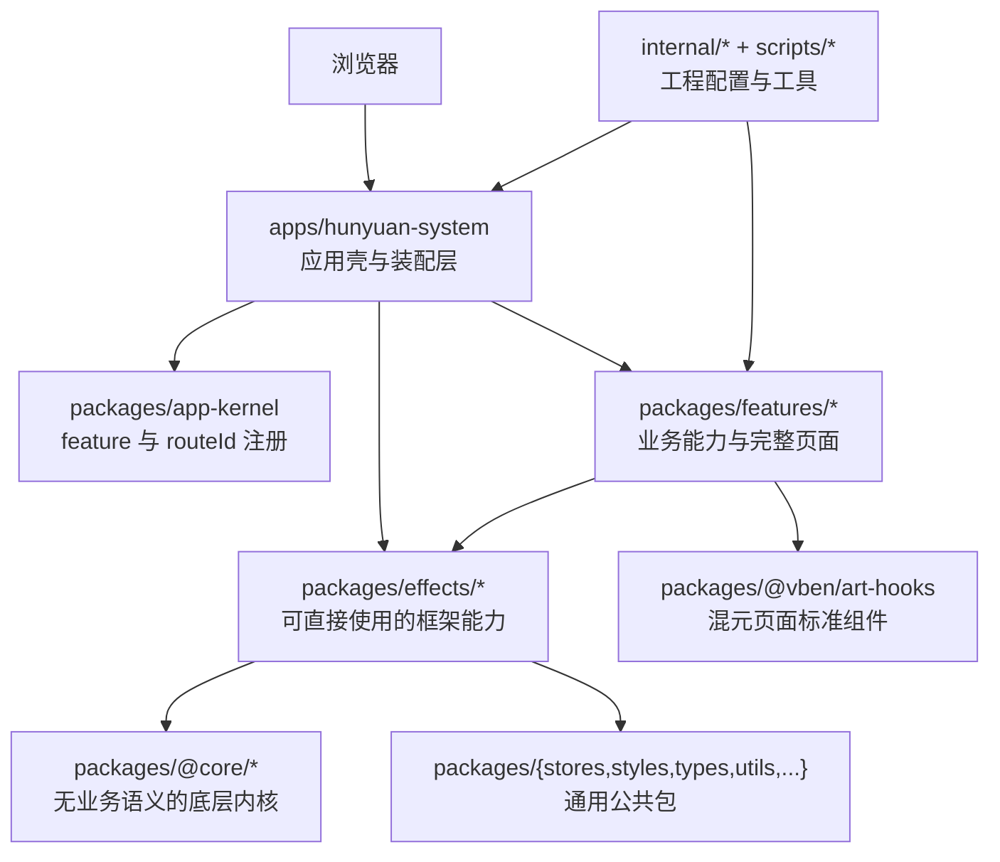
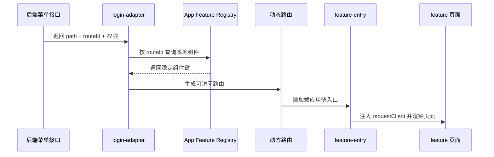

# 前端文件架构与模块说明

> 适用目录：`hunyuan-design/`
> 基线日期：2026-07-25
> 文档依据：当前工作区实际目录、pnpm workspace、应用入口、App Kernel 注册表及 feature 包。本文描述的是当前前端，不代表后端模块结构，也不提出新的迁移路线图。

## 1. 架构结论

前端采用 Vue 3、TypeScript、Vite、pnpm workspace 和 Turbo 组成的 Monorepo。当前生产业务应用是 `apps/hunyuan-system`，它只负责应用启动、布局、认证、路由、全局状态、请求实例和 feature 装配；完整业务页面、业务 API 客户端、业务类型与对应测试主要归属 `packages/features/*`。



依赖方向必须保持从应用装配层指向业务 feature，再指向通用能力层：

```text
apps/hunyuan-system
  -> packages/app-kernel
  -> packages/features/*
      -> packages/@vben/art-hooks
      -> packages/effects/*
      -> packages/{stores,types,utils,...}
          -> packages/@core/*
```

`packages/features/*` 不得反向导入 `apps/hunyuan-system`。应用通过 Vue `provide/inject` 向 feature 注入请求客户端等运行时能力，feature 不依赖应用内部的 `#/api/system/*`、`#/store/*` 或 `#/views/*`。

## 2. 前端根目录总览

```text
hunyuan-design/
├─ apps/                 可运行应用
│  ├─ hunyuan-system/    当前混元生产业务应用
│  ├─ web-ele/           Vben + Element Plus 示例应用
│  └─ backend-mock/      本地 Mock API 服务
├─ packages/             可复用运行时代码
│  ├─ features/          混元业务 feature
│  ├─ app-kernel/        feature 装配协议
│  ├─ @vben/             项目增强组件
│  ├─ effects/           带 Vue/浏览器副作用的通用能力
│  ├─ @core/             无业务语义的底层内核
│  └─ 其他公共包         图标、语言、状态、样式、类型、工具等
├─ internal/             构建、类型、Lint 等内部工程配置
├─ scripts/              仓库级命令与部署脚本
├─ docs/                 前端自身的历史架构与组件资料
├─ runtime/              本地验收运行产物，不属于产品源码
├─ .changeset/           包版本变更记录
├─ .github/              CI、Issue、PR 和仓库协作配置
├─ .vscode/              VS Code 推荐配置
├─ .claude/              其他代理工具的项目配置目录
├─ node_modules/         pnpm 安装依赖，生成物
├─ .turbo/               Turbo 缓存，生成物
└─ 根配置文件            workspace、构建、测试、格式和提交规范
```

### 2.1 根目录文件夹用途

| 文件夹 | 用途 | 是否产品源码 |
| --- | --- | --- |
| `apps/` | 放置能独立启动、构建或部署的应用 | 是 |
| `packages/` | 放置应用之间可复用的运行时代码和业务 feature | 是 |
| `internal/` | 放置仅服务本仓库的构建工具、共享配置和 Node 工具 | 工程源码 |
| `scripts/` | 放置部署脚本、Turbo 命令封装和仓库维护 CLI | 工程源码 |
| `docs/` | 保存前端架构、兼容性、阶段报告和测试页说明 | 文档 |
| `runtime/` | 保存本地浏览器验收等临时运行证据 | 否，不应被业务代码依赖 |
| `.changeset/` | 记录 workspace 包的版本与变更说明 | 发布元数据 |
| `.github/` | GitHub Actions、模板、依赖更新和代码所有权配置 | 工程配置 |
| `.vscode/` | 编辑器扩展、启动、代码片段与工作区设置 | 工程配置 |
| `.claude/` | 面向代理工具的本地项目配置 | 工程配置 |
| `node_modules/` | pnpm 创建的依赖链接和包缓存入口 | 生成物 |
| `.turbo/` | Turbo 任务缓存 | 生成物 |

## 3. `apps/`：可运行应用

### 3.1 `apps/hunyuan-system/`：混元业务应用壳

这是当前业务系统的生产前端。它不再承载完整平台业务实现，主要职责是把框架能力、应用配置和各 feature 组装成一个可运行应用。

```text
apps/hunyuan-system/
├─ public/               不经打包转换的静态资源
├─ src/
│  ├─ adapter/           UI 组件与表单/表格适配
│  ├─ api/               应用级请求实例、认证和菜单入口
│  ├─ app-kernel/        当前应用的 feature 注册表
│  ├─ architecture/      架构边界自动化测试
│  ├─ feature-entries/   feature 的薄装配入口
│  ├─ layouts/           基础布局、认证布局和 iframe 布局出口
│  ├─ locales/           应用级中英文文案
│  ├─ router/            路由创建、守卫、权限路由生成
│  ├─ store/             应用级 Pinia store
│  ├─ test-utils/        应用测试辅助工具
│  ├─ types/             应用局部类型声明
│  ├─ views/             核心壳页面和少量尚由应用装配的入口
│  ├─ app.vue            Vue 根组件
│  ├─ bootstrap.ts       插件、store、i18n、router 的统一安装
│  ├─ main.ts            初始化偏好并启动 bootstrap
│  └─ preferences.ts     当前应用的偏好覆盖配置
├─ index.html            Vite HTML 入口
├─ package.json          `@hunyuan/system` 依赖和命令
├─ tsconfig.json         应用 TypeScript 配置
└─ vite.config.ts        应用 Vite 配置
```

#### `src/` 下每个文件夹的职责

| 文件夹 | 职责 | 允许放置的内容 |
| --- | --- | --- |
| `adapter/` | 将 Vben 的抽象 UI 能力绑定到 Element Plus/VXE Table | `component/` 组件适配、`form.ts` 表单适配、`vxe-table.ts` 表格适配 |
| `api/core/` | 登录、用户信息、菜单等应用启动必需 API | 认证和应用壳契约；不能继续堆放完整平台业务 API |
| `api/system/` | 历史业务 API 目录 | 当前只保留架构边界测试；新的业务客户端必须进入所属 feature |
| `app-kernel/` | 组装所有启用 feature | `feature-registry.ts`，为每个 `routeId` 绑定懒加载入口 |
| `architecture/` | 防止架构回退 | feature 反向依赖、历史目录残留等边界测试 |
| `feature-entries/` | 在应用侧提供请求实例并渲染 feature 页面 | 每个文件应是很薄的 `provide + FeaturePage` 包装，不写业务逻辑 |
| `layouts/` | 暴露基础布局、认证布局和 iframe 视图 | `basic.vue`、`auth.vue`、`index.ts` |
| `locales/langs/zh-CN/` | 应用级中文文案 | 壳页面、菜单标题等文案 JSON |
| `locales/langs/en-US/` | 应用级英文文案 | 与中文键结构保持一致的文案 JSON |
| `router/routes/modules/` | 登录后仍需静态声明的应用路由模块 | 当前系统首页等壳路由；后端业务菜单通过动态路由生成 |
| `router/routes/` | 汇总 core、static、dynamic、fallback 路由 | `core.ts`、`index.ts`、`modules/` |
| `router/` | 创建 Router、安装守卫并生成权限路由 | `index.ts`、`guard.ts`、`access.ts` 及路由契约测试 |
| `store/` | 应用级状态 | 当前主要是认证 store 和统一导出 |
| `test-utils/` | 测试路径、fixture 等应用测试辅助 | 不进入生产业务逻辑 |
| `types/` | Vite/组件库等应用局部声明补丁 | `.d.ts` 文件 |
| `views/_core/` | 登录、个人中心、异常页、关于页等应用核心页面 | 与具体业务 feature 无关的壳页面 |
| `views/organization/` | 组织目录的应用入口包装 | 当前通过页面包装完成客户端注入，完整实现归属 organization feature |
| `views/system/` | 系统首页及部分应用入口包装 | `home` 属壳页面；菜单、角色、岗位、员工等应保持薄入口或逐步由 feature 直接装配 |
| `views/support/` | 历史平台支持页目录 | 当前生产页面应为 0，仅允许保留迁移边界测试，不能新增业务页面 |

#### `feature-entries/` 当前模块

| 文件夹 | 对应 feature | 页面范围 |
| --- | --- | --- |
| `platform-audit/` | `@hunyuan/feature-platform-audit` | 登录日志、操作日志 |
| `platform-configuration/` | `@hunyuan/feature-platform-configuration` | 参数配置、数据字典 |
| `platform-devtools/` | `@hunyuan/feature-platform-devtools` | 接口加解密 |
| `platform-file/` | `@hunyuan/feature-platform-file` | 文件管理 |
| `platform-notification/` | `@hunyuan/feature-platform-notification` | 消息、短信模板、短信发送日志 |
| `platform-runtime/` | `@hunyuan/feature-platform-runtime` | 定时任务、单号、缓存、Reload |
| `platform-security/` | `@hunyuan/feature-platform-security` | 安全基线、登录失败锁定、数据脱敏验证 |

### 3.2 `apps/web-ele/`：Element Plus 示例应用

这是 Vben 上游风格的演示/参考应用，不是混元生产业务入口。根命令中仍有部分默认脚本指向它，因此调整仓库脚本前必须区分 `@vben/web-ele` 和 `@hunyuan/system`。

| 文件夹 | 用途 |
| --- | --- |
| `public/` | 示例应用静态资源 |
| `src/adapter/` | Element Plus、表单和 VXE Table 适配示例 |
| `src/api/` | Mock/示例请求客户端及认证 API |
| `src/layouts/` | 示例应用布局入口 |
| `src/locales/` | 示例应用中英文语言包 |
| `src/router/` | 示例静态路由、守卫和权限路由 |
| `src/store/` | 示例认证状态 |
| `src/types/` | 示例应用局部声明 |
| `src/views/_core/` | 登录、个人中心、异常页等核心示例 |
| `src/views/dashboard/` | 分析页和工作台示例 |
| `src/views/demos/` | 表单、表格、编辑页、详情页及 Element Plus 示例 |
| `dist/` | 构建输出，非源码 |
| `.turbo/` | 本应用 Turbo 缓存，非源码 |

### 3.3 `apps/backend-mock/`：本地 Mock 服务

该应用使用 Nitro/H3 提供前端独立开发所需的模拟接口，不替代 `hunyuan-backend`。

| 文件夹 | 用途 |
| --- | --- |
| `api/auth/` | 模拟登录、刷新令牌和退出 |
| `api/demo/` | BigInt 等协议行为演示 |
| `api/menu/` | 模拟菜单接口 |
| `api/system/dept/` | 模拟部门增删改查 |
| `api/system/menu/` | 模拟菜单查询和唯一性校验 |
| `api/system/role/` | 模拟角色接口 |
| `api/system/user/` | 模拟用户接口 |
| `api/table/` | 通用表格数据模拟 |
| `api/timezone/` | 时区设置模拟 |
| `api/user/` | 当前用户信息模拟 |
| `middleware/` | API 请求中间件 |
| `routes/` | Nitro 兜底路由 |
| `utils/` | JWT、Cookie、响应、Mock 数据和时区工具 |
| `.nitro/`、`.output/` | Nitro 生成物，非源码 |

## 4. `packages/features/`：业务模块

feature 是完整业务能力的主要所有权边界。一个 feature 通常包含：

```text
packages/features/<feature>/
├─ src/
│  ├─ index.ts            声明 feature id、能力和 routeId，并导出公共契约
│  ├─ dependencies.ts     Vue InjectionKey 等运行时依赖契约
│  └─ <submodule>/
│     ├─ index.vue        完整业务页面
│     ├─ client.ts        API 客户端工厂或请求函数
│     ├─ contract.ts      业务 DTO/命令类型（需要时）
│     ├─ components/      只属于该子模块的组件
│     └─ *.test.ts        客户端、页面或组件测试
├─ package.json           包名、exports、依赖
└─ tsconfig.json          feature 类型检查配置
```

### 4.1 当前 feature 模块清单

| 文件夹 / 包名 | 负责模块 | 内部文件夹用途 |
| --- | --- | --- |
| `access/` / `@hunyuan/feature-access` | 访问控制 | `menu/` 菜单管理；`role/` 角色管理；根部 `client/contract/dependencies` 提供访问控制公共协议 |
| `foundation-acceptance/` / `@hunyuan/feature-foundation-acceptance` | 底座接入探针 | 用最小页面验证 feature 可只依赖公开协议接入应用，不承载正式业务 |
| `identity-account/` / `@hunyuan/feature-identity-account` | 当前账号与个人资料 | `profile/` 个人资料、密码、安全与通知设置；根部客户端和依赖协议负责账号 API |
| `identity-employee/` / `@hunyuan/feature-identity-employee` | 员工身份管理 | `employee/` 员工列表和表单；`components/` 员工表格、组织树和员工表单 |
| `organization/` / `@hunyuan/feature-organization` | 组织目录 | `department-directory/` 部门目录；`position-directory/` 岗位目录；各自拥有 client、contract 和 dependencies |
| `platform-audit/` / `@hunyuan/feature-platform-audit` | 平台审计 | `login-log/` 登录日志；`operation-log/` 操作日志；详情抽屉归属后者 `components/` |
| `platform-configuration/` / `@hunyuan/feature-platform-configuration` | 平台配置 | `configuration/` 参数配置；`dictionary/` 数据字典及字典数据抽屉 |
| `platform-devtools/` / `@hunyuan/feature-platform-devtools` | 生产保留的开发辅助能力 | `api-encrypt/` 接口加解密；已退役能力不应在此补造空页面 |
| `platform-file/` / `@hunyuan/feature-platform-file` | 文件平台 | `management/` 文件查询、上传、删除等管理页面和客户端 |
| `platform-notification/` / `@hunyuan/feature-platform-notification` | 通知平台 | `message/` 消息管理；`sms/` 短信模板、发送日志和共享客户端 |
| `platform-runtime/` / `@hunyuan/feature-platform-runtime` | 运行时运维能力 | `job/` 定时任务；`serial-number/` 单号；`cache/` 缓存；`reload/` 热重载；各模块的抽屉放在自身 `components/` |
| `platform-security/` / `@hunyuan/feature-platform-security` | 安全治理 | `protection/` 安全基线和登录失败；`data-masking/` 脱敏验证 |

### 4.2 feature 文件规则

- `index.ts` 是模块公开边界，只导出应用装配需要的 feature 定义、注入键、客户端工厂和公共类型。
- `dependencies.ts` 描述 feature 需要应用提供什么，不直接导入应用实例。
- `client.ts` 负责接口地址、参数和返回数据转换，不包含页面状态。
- `contract.ts` 只放该模块稳定使用的类型，不把后端所有 DTO 原样复制成全局类型。
- `components/` 中组件只能属于当前子模块；跨 feature 复用前先判断是否具有真正的通用语义。
- `*.test.ts` 与所有者代码同包放置，避免测试重新依赖应用内部实现。

## 5. `packages/app-kernel/`：应用装配协议

| 路径 | 用途 |
| --- | --- |
| `src/index.ts` | 定义 `AppFeatureDefinition`、`AppFeatureRegistration`、`FeatureRouteDefinition`，创建唯一 feature 注册表 |
| `src/index.test.ts` | 验证重复 feature id、依赖缺失、重复/遗漏 routeId 等失败分支 |
| `package.json` | 发布为 `@hunyuan/app-kernel`，供应用和各 feature 共同依赖 |

App Kernel 不实现业务页面。它负责校验模块声明，将稳定 `routeId` 映射为应用可识别的懒加载组件键，并在启动阶段阻止冲突或不完整装配。

## 6. `packages/@vben/art-hooks/`：混元页面标准组件

这是当前页面规范的可复用实现层，业务 feature 可直接使用。

| 文件夹 | 用途 |
| --- | --- |
| `src/common/components/art-action-group/` | 行内或区域动作组 |
| `src/common/components/art-page-actions/` | 页面级主次操作区 |
| `src/common/components/art-search-panel/` | 标准搜索区 |
| `src/common/components/art-status-tag/` | 统一状态标签 |
| `src/table/components/art-table/` | 标准数据表格与分页 |
| `src/table/components/art-table-header/` | 表格标题和工具栏 |
| `src/table/components/art-table-panel/` | 表格页面组合面板 |
| `src/table/composables/` | 表格组合式状态逻辑 |
| `src/table/hooks/` | 表格辅助 hooks |
| `src/table/types/` | 表格类型 |
| `src/table/utils/` | 表格纯工具函数 |
| `src/tree/components/art-org-tree/` | 组织树筛选组件 |
| `src/edit/components/art-edit-page/` | 标准编辑页容器 |
| `src/edit/components/art-edit-section/` | 编辑页分区 |
| `src/edit/components/art-attachment-*` | 附件表格和上传 |
| `src/edit/components/art-image-upload/` | 图片上传 |
| `src/detail/components/art-detail*/` | 详情页、详情面板和字段展示 |

## 7. `packages/effects/`：通用运行时能力

`effects` 可以依赖 Vue、Router、浏览器 API 或具体组件库，因此属于可直接用于应用的效果层。

| 文件夹 / 包名 | 用途 | 主要子文件夹 |
| --- | --- | --- |
| `access/` / `@vben/access` | 权限码判断、动态路由和访问指令 | `src/` |
| `common-ui/` / `@vben/common-ui` | 组合型通用 UI 和业务无关页面 | `components/`、`ui/`；含验证码、裁剪、页面容器、树、认证、仪表盘、异常页等 |
| `hooks/` / `@vben/hooks` | 面向 Vue/浏览器的组合式 hooks | `src/` |
| `layouts/` / `@vben/layouts` | 登录布局、主布局、iframe、路由缓存和全局小部件 | `authentication/`、`basic/`、`iframe/`、`route-cached/`、`widgets/` |
| `plugins/` / `@vben/plugins` | 第三方库的统一 Vue 封装 | `echarts/`、`motion/`、`tiptap/`、`vxe-table/` |
| `request/` / `@vben/request` | Axios 请求客户端和拦截器体系 | `request-client/`、`request-client/modules/` |

`common-ui/src/components/` 中的 `api-component`、`captcha`、`col-page`、`count-to`、`cropper`、`ellipsis-text`、`icon-picker`、`json-viewer`、`loading`、`page`、`resize`、`tippy`、`tree` 分别负责其同名通用控件。`common-ui/src/ui/` 则放置 about、authentication、dashboard、fallback、profile 等可组合的通用页面块。

## 8. `packages/@core/`：底层内核

`@core` 不应包含“员工、组织、角色、审计”等混元业务语义。

### 8.1 `base/`

| 文件夹 / 包名 | 用途 |
| --- | --- |
| `base/design/` / `@vben-core/design` | CSS 变量、设计 token、BEM/SCSS 工具；`src/css/`、`design-tokens/`、`scss-bem/` 分别承载样式基础、token 和样式工具 |
| `base/icons/` / `@vben-core/icons` | 最底层图标类型和渲染能力 |
| `base/shared/` / `@vben-core/shared` | 无 Vue 业务依赖的共享工具；`cache/`、`color/`、`constants/`、`utils/` |
| `base/typings/` / `@vben-core/typings` | 框架基础 TypeScript 类型 |

### 8.2 组合式能力与偏好

| 文件夹 / 包名 | 用途 |
| --- | --- |
| `composables/` / `@vben-core/composables` | 最底层 Vue composables；`use-simple-locale/` 提供轻量语言能力 |
| `preferences/` / `@vben-core/preferences` | 偏好配置模型、默认值、持久化与更新逻辑 |

### 8.3 `ui-kit/`

| 文件夹 / 包名 | 用途 |
| --- | --- |
| `form-ui/` | 表单 schema、渲染器和字段组件；`components/` 放组件，`form-render/` 放 schema 渲染逻辑 |
| `layout-ui/` | 无业务语义的布局结构；`components/`、`hooks/`、`components/widgets/` |
| `menu-ui/` | 菜单渲染、折叠和定位；`components/normal-menu/` 为常规菜单实现，另有 `hooks/`、`utils/` |
| `popup-ui/` | Alert、Drawer、Modal 基础设施；分别位于 `alert/`、`drawer/`、`modal/` |
| `shadcn-ui/` | 基于 Reka/Shadcn 风格的原子控件 | `assets/` 资源、`components/` 项目封装、`ui/` 原子控件 |
| `tabs-ui/` | 标签页和多页签导航 | `components/tabs/`、`tabs-chrome/`、`widgets/` |

`shadcn-ui/src/ui/` 按控件名分目录：`accordion`、`alert-dialog`、`avatar`、`badge`、`breadcrumb`、`button`、`card`、`checkbox`、`context-menu`、`dialog`、`dropdown-menu`、`form`、`hover-card`、`input`、`label`、`number-field`、`pagination`、`pin-input`、`popover`、`radio-group`、`resizable`、`scroll-area`、`select`、`separator`、`sheet`、`switch`、`tabs`、`textarea`、`toggle`、`toggle-group`、`tooltip`、`tree`。这些目录只实现对应原子控件，不承载业务页面。

## 9. 其他公共 `packages/`

| 文件夹 / 包名 | 用途 | 主要子文件夹 |
| --- | --- | --- |
| `constants/` / `@vben/constants` | 路由、存储键、应用常量 | `src/` |
| `icons/` / `@vben/icons` | 应用图标聚合与注册 | `src/iconify/`、`src/icons/`、`src/svg/icons/` |
| `locales/` / `@vben/locales` | 公共 i18n 初始化与语言资源 | `src/langs/en-US/`、`src/langs/zh-CN/` |
| `preferences/` / `@vben/preferences` | 对 core 偏好能力的应用级出口 | `src/` |
| `stores/` / `@vben/stores` | 公共 Pinia stores 和持久化 | `src/modules/` |
| `styles/` / `@vben/styles` | 全局样式及多 UI 库主题适配 | `src/global/`、`antd/`、`antdv-next/`、`ele/`、`naive/` |
| `types/` / `@vben/types` | 对外统一的框架类型 | `src/` |
| `utils/` / `@vben/utils` | 通用工具和路由树辅助 | `src/helpers/`、`src/helpers/__tests__/` |

## 10. `internal/`：仓库内部工程包

这些包只服务 Monorepo 的开发、检查和构建，不应被业务页面当作运行时业务依赖。

| 文件夹 / 包名 | 用途 | 主要子文件夹 |
| --- | --- | --- |
| `lint-configs/commitlint-config/` | Commitlint 和交互式提交规范 | 配置源码及构建输出 |
| `lint-configs/eslint-config/` | ESLint 共享配置 | `src/configs/` 按语言/文件类型拆分规则 |
| `lint-configs/oxfmt-config/` | Oxfmt 共享格式配置 | `src/` |
| `lint-configs/oxlint-config/` | Oxlint 共享规则 | `src/configs/` |
| `lint-configs/stylelint-config/` | Vue/SCSS/CSS Stylelint 规则 | 配置源码 |
| `node-utils/` | workspace 扫描、进程、文件、版本等 Node 工具 | `src/`、`src/__tests__/`、`scripts/` |
| `tailwind-config/` | Tailwind、Iconify 和动画的共享配置 | `src/` |
| `tsconfig/` | 应用、库、Node 等共享 TypeScript 配置 | JSON 配置集合 |
| `vite-config/` | 应用/库统一 Vite 配置和插件 | `src/config/`、`src/plugins/`、`src/utils/`；`inject-app-loading/` 注入首屏 loading |

各包中的 `dist/`、`.turbo/` 和 `node_modules/` 都是生成物，不是源文件夹。

## 11. `scripts/`：仓库工具与部署

| 文件夹 / 包名 | 用途 | 主要子文件夹 |
| --- | --- | --- |
| `deploy/` | 本地 Docker 镜像等部署脚本 | Shell 脚本 |
| `turbo-run/` / `@vben/turbo-run` | 为 Turbo 任务提供交互式选择和执行封装 | `bin/` 命令入口、`src/` 源码、`dist/` 构建产物 |
| `vsh/` / `@vben/vsh` | 仓库维护 CLI | `check-circular/` 循环依赖、`check-dep/` 依赖检查、`code-workspace/` 工作区生成、`lint/` 检查格式、`publint/` 包发布检查 |

## 12. 文档、运行证据与协作配置

### 12.1 `hunyuan-design/docs/architecture/`

保存早期 Art 组件接入、VueUse 兼容性、测试页指南、构建问题和阶段报告。它是历史实施资料，不得覆盖仓库根目录 `docs/architecture-baseline/` 中更新的关闭或验收结论。

### 12.2 `hunyuan-design/runtime/`

当前 `a2-1-browser/` 用于保存 A2.1 浏览器验收过程产物。这里不是静态资源目录，也不能被生产代码引用；新的可发布静态资源应放到对应应用的 `public/` 或源码资源目录。

### 12.3 `.github/`

| 文件夹 | 用途 |
| --- | --- |
| `actions/setup-node/` | CI 的 Node/pnpm 环境复用 action |
| `ISSUE_TEMPLATE/` | Bug、文档和功能请求模板 |
| `workflows/` | CI、构建、部署、CodeQL、Changeset、Release 等流水线 |

根部的 `CODEOWNERS`、PR 模板、提交规范、Dependabot 和语义检查配置负责仓库协作。

### 12.4 `.changeset/`、`.vscode/`、`.claude/`

- `.changeset/`：workspace 包变更说明和版本策略。
- `.vscode/`：推荐扩展、启动配置、全局代码片段和编辑器设置。
- `.claude/`：代理工具配置目录，不参与浏览器运行。

## 13. 根配置文件职责

| 文件 | 用途 |
| --- | --- |
| `package.json` | 根命令、Node/pnpm 版本、共享开发依赖和依赖 catalog |
| `pnpm-workspace.yaml` | 声明 apps、packages、internal、scripts 的 workspace 范围及统一依赖版本 |
| `pnpm-lock.yaml` | 锁定完整依赖图 |
| `turbo.json` | 定义 build、dev、typecheck、e2e 等任务依赖和缓存输出 |
| `vitest.config.ts` | Monorepo 单元测试配置 |
| `eslint.config.mjs` | ESLint 入口 |
| `oxlint.config.ts` | Oxlint 入口 |
| `oxfmt.config.ts` | Oxfmt 入口 |
| `stylelint.config.mjs` | Stylelint 入口 |
| `cspell.json` | 拼写检查词典和规则 |
| `lefthook.yml` | Git hooks |
| `.commitlintrc.js` | 提交信息规则入口 |
| `.browserslistrc` | 浏览器兼容目标 |
| `.node-version` | 本地 Node 版本提示 |
| `.npmrc` | pnpm/npm 行为配置 |
| `.editorconfig` | 编辑器基础格式 |
| `.gitattributes` | Git 文本和行尾规则 |
| `.gitignore` | Git 忽略规则 |
| `.dockerignore` | Docker 构建上下文忽略规则 |
| `hunyuan-design.code-workspace` | 当前项目 VS Code 工作区 |
| `vben-admin.code-workspace` | 上游 Vben 工作区配置 |
| `README*.md` | 多语言仓库说明 |
| `LICENSE` | 上游 MIT 许可证 |

## 14. 路由与模块装配流程



关键文件：

- `apps/hunyuan-system/src/app-kernel/feature-registry.ts`：应用唯一模块注册表。
- `packages/features/*/src/index.ts`：模块声明的 `id`、依赖、能力和 `routeId`。
- `apps/hunyuan-system/src/api/core/login-adapter.ts`：把后端菜单的稳定标识转换为组件键。
- `apps/hunyuan-system/src/router/access.ts`：合并静态页面表和 App Kernel 页面表，生成权限路由。
- `apps/hunyuan-system/src/feature-entries/*`：注入应用请求客户端并加载 feature 页面。

后端菜单不应再保存前端源码 `component` 路径。新页面要先确定 owner feature，再声明稳定 `routeId`，最后在应用注册表中绑定加载器。

## 15. 新增代码应该放在哪里

| 需求 | 正确位置 |
| --- | --- |
| 新增完整业务页面 | `packages/features/<owner>/src/<submodule>/` |
| 新增业务 API | 对应 feature 的 `client.ts` |
| 新增业务 DTO/命令类型 | 对应 feature 的 `contract.ts` |
| 新增 feature 所需应用能力 | feature `dependencies.ts` 定义协议，应用入口 `provide` 实例 |
| 新增后端动态菜单页面 | feature `index.ts` 声明 `routeId`，应用 `feature-registry.ts` 装配 |
| 新增登录前核心页面 | `apps/hunyuan-system/src/views/_core/` |
| 新增应用启动插件 | `apps/hunyuan-system/src/bootstrap.ts` |
| 新增全局认证状态 | `apps/hunyuan-system/src/store/` |
| 新增项目通用列表/编辑/详情能力 | 优先扩展 `packages/@vben/art-hooks/` |
| 新增无业务语义的组合 UI | `packages/effects/common-ui/` |
| 新增无副作用纯工具 | `packages/utils/` 或更底层 `packages/@core/base/shared/` |
| 新增原子 UI 控件 | `packages/@core/ui-kit/` 对应子包 |
| 新增构建插件 | `internal/vite-config/` |
| 新增仓库检查命令 | `scripts/vsh/` |
| 新增应用静态资源 | 对应 `apps/<app>/public/` 或源码资源目录 |
| 新增浏览器验收证据 | 明确命名的 `runtime/` 子目录，且不得被生产代码依赖 |

## 16. 不应继续使用的落点

- 不在 `apps/hunyuan-system/src/api/system/` 新增平台业务客户端。
- 不在 `apps/hunyuan-system/src/views/support/` 恢复或新增完整业务页面。
- 不让 feature 导入 `apps/hunyuan-system` 的 `#/*` 别名。
- 不把只属于单个 feature 的组件提前放入全局公共包。
- 不修改 `apps/web-ele` 来实现混元生产需求。
- 不编辑 `node_modules/`、`dist/`、`.turbo/`、`.nitro/` 中的文件。
- 不把 `runtime/` 验收产物当作产品静态资源。

## 17. 常用命令与验证边界

以下命令从 `hunyuan-design/` 执行：

```powershell
# 当前混元业务应用开发服务器
pnpm --filter @hunyuan/system dev

# 当前混元业务应用类型检查
pnpm --filter @hunyuan/system typecheck

# 当前混元业务应用生产构建
pnpm --filter @hunyuan/system build

# 全量前端单元测试
pnpm test:unit

# Monorepo 依赖、循环依赖、类型和拼写检查
pnpm check
```

根 `pnpm dev`、`pnpm build:ele` 和 `pnpm preview` 默认指向 `@vben/web-ele`，不能把它们的成功等同于 `@hunyuan/system` 验证通过。仅修改文档时无需重复运行前端构建；修改 feature 契约或应用装配时，应至少验证受影响包、`@hunyuan/system` TypeScript 及相应单元测试。

## 18. 维护本文件的规则

出现以下变化时应同步更新本文：

1. 新增、删除或重命名 `apps/*`、`packages/features/*` 或公共 workspace 包。
2. feature 所有权、依赖方向或请求注入方式变化。
3. `routeId` 装配流程或 App Kernel 契约变化。
4. 生产应用从 `apps/hunyuan-system` 切换到其他入口。
5. 根命令的默认应用发生变化。

更新时以当前 checkout 和最新关闭记录为准；历史阶段文档只能作为来源补充，不能覆盖更晚的架构关闭结论。
