# 系统设置模块整体对接设计

## 背景

`hunyuan-system` 已经完成真实登录、后端菜单加载、组织架构相关页面接入，以及未知后端页面的 `module-bridge` 承接。当前系统管理能力已经不再缺少“菜单入口”，而是缺少“菜单入口命中真实页面”的逐模块落地。

本次任务不是随意补几个页面，而是要把“数据库菜单配置 -> 登录返回菜单 -> 动态路由命中 -> 本地真实页面 -> 页面 API -> 后端 controller/service”整条链路先梳理清楚，再按 `AGENTS.md` 的要求逐步实施。

## 本次目标

1. 梳理系统设置菜单组的真实页面路径，不自造路径。
2. 梳理每个菜单对应的前端页面、后端接口、核心数据流和缺口。
3. 给每个模块提供清晰流程图，明确第一版页面职责。
4. 在整体设计确认后，按“一次一个可验证增量”推进实现。

## 全局约束

- 严格以数据库 `t_menu` 中已有的 `path` 和 `component` 为准，不自造页面路径。
- 优先复用现有项目模式，不新增依赖。
- 列表/查询/表格页面遵循 `docs/frontend-list-table-page-standard.md`。
- 编辑/详情场景若后续出现，遵循 `docs/frontend-edit-detail-page-standard.md`。
- 页面只调用 `apps/hunyuan-system/src/api/system/*.ts`，不把请求逻辑写进共享组件。
- 实施阶段不用子代理，按单模块、单增量逐步执行。
- 全程使用 UTF-8；如代码复杂到需要说明，可使用简洁中文注释。

## 当前证据

### 1. 菜单路径来源

数据库 `t_menu` 已经为系统设置菜单组配置了固定的路由路径和组件路径：

- 菜单管理：`/menu/list` -> `/system/menu/menu-list.vue`
- 参数配置：`/config/config-list` -> `/support/config/config-list.vue`
- 数据字典：`/setting/dict` -> `/support/dict/index.vue`
- 单号管理：`/support/serial-number/serial-number-list` -> `/support/serial-number/serial-number-list.vue`
- 缓存管理：`/support/cache/cache-list` -> `/support/cache/cache-list.vue`
- Reload：`/hook` -> `/support/reload/reload-list.vue`
- 文件管理：`/support/file/file-list` -> `/support/file/file-list.vue`
- 定时任务：`/job/list` -> `/support/job/job-list.vue`
- 消息管理：`/message` -> `/support/message/message-list.vue`

### 2. 动态路由命中规则

前端登录后会通过 `/login` 或 `/login/getLoginInfo` 获取 `menuList`，再由 `login-adapter.ts` 转成动态路由：

1. 读取后端 `component`
2. 规范化成本地 `views` 路径
3. 若本地存在对应 `.vue`，则进入真实页面
4. 若本地不存在对应 `.vue`，则进入 `module-bridge`

因此，“数据库里有菜单”不等于“前端已经有真实页面”。

### 3. 当前前端实际落地状态

当前工作区中，系统设置菜单组已经有 3 个真实页面命中本地 `views`：

- `views/system/menu/menu-list.vue`
- `views/support/config/config-list.vue`
- `views/support/dict/index.vue`

仍然缺失并会落入 `views/system/module-bridge/index.vue` 的模块为：

- `views/support/file/file-list.vue`
- `views/support/job/job-list.vue`
- `views/support/message/message-list.vue`
- `views/support/serial-number/serial-number-list.vue`
- `views/support/cache/cache-list.vue`
- `views/support/reload/reload-list.vue`

## 总体架构

### 总链路图

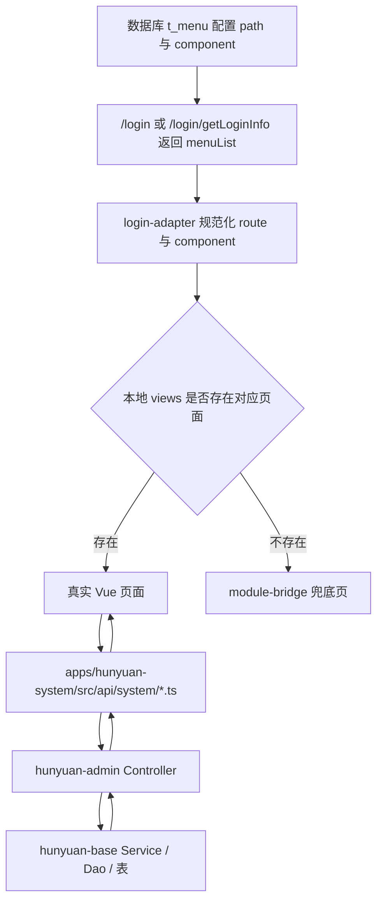

### 页面职责边界

- `views/support/*`：承接模块页面、局部弹窗、页面状态。
- `api/system/*.ts`：定义 DTO、表单 payload、请求函数。
- `@vben/art-hooks`：只负责展示与交互 primitive，不直接依赖业务接口。
- `hunyuan-admin`：提供系统管理入口 controller。
- `hunyuan-base`：提供基础能力 service/dao/domain。

## 方案比较

### 方案 A：完全按接口逐页直推

优点：

- 与后端能力最贴近，不容易做出假交互。
- 前端每页都能直接围绕 controller/form/vo 建模。

缺点：

- 页面之间容易出现风格和交互节奏不统一。
- `缓存管理 / Reload / 单号管理` 与标准管理页差异会越来越大。

### 方案 B：统一壳子 + 接口驱动分型

优点：

- 仍然以后端接口为真，不凭空发明前端能力。
- 同时能把 6 个模块收敛成两类页面语法：标准管理页、工具操作页。
- 最符合当前 `参数配置 / 数据字典 / 菜单管理` 已有基线，便于系统设置菜单形成一组一致风格。

缺点：

- 需要先做页面分型与 API 边界梳理，前期设计成本稍高。

### 方案 C：先补齐全部页面骨架，再逐页补深度

优点：

- 菜单会较快从桥接页切成真实页面。

缺点：

- 容易出现“页面都在，但真实交互不完整”的半成品。
- 不符合这次“先理解接口，再做合适对接”的要求。

### 推荐方案

推荐采用 **方案 B**：

1. 先完成系统设置整体对接设计。
2. 以后端接口能力为起点，将系统设置剩余 6 个模块分为“标准管理页族”和“工具操作页族”。
3. 先落地结构最稳定的标准管理页，再单独处理复杂行为页与工具页。

## 系统设置模块总览

| 模块 | 数据库组件路径 | 当前状态 | 后端入口 | 页面分型 | 推荐批次 |
| --- | --- | --- | --- | --- | --- |
| 菜单管理 | `/system/menu/menu-list.vue` | 已落地 | `MenuController` `/menu/*` | 基线页 | 基线验证 |
| 参数配置 | `/support/config/config-list.vue` | 已落地 | `AdminConfigController` `/config/*` | 标准管理页 | 基线验证 |
| 数据字典 | `/support/dict/index.vue` | 已落地 | `AdminDictController` `/dict/*` | 标准管理页 + 子表抽屉 | 基线验证 |
| 文件管理 | `/support/file/file-list.vue` | 未落地 | `AdminFileController` + `FileController` | 标准管理页 | 第一批 |
| 定时任务 | `/support/job/job-list.vue` | 未落地 | `AdminSmartJobController` `/job/*` | 标准管理页 + 日志抽屉 | 第二批 |
| 消息管理 | `/support/message/message-list.vue` | 未落地 | `AdminMessageController` + `MessageController` | 标准管理页 + 发送弹窗 | 第一批 |
| 单号管理 | `/support/serial-number/serial-number-list.vue` | 未落地 | `AdminSerialNumberController` `/serialNumber/*` | 工具操作页 + 记录抽屉 | 第三批 |
| 缓存管理 | `/support/cache/cache-list.vue` | 未落地 | `AdminCacheController` `/cache/*` | 工具操作页 + keys 抽屉 | 第三批 |
| Reload | `/support/reload/reload-list.vue` | 未落地 | `AdminReloadController` `/reload/*` | 工具操作页 + 结果抽屉 | 第三批 |

### 系统设置现状图

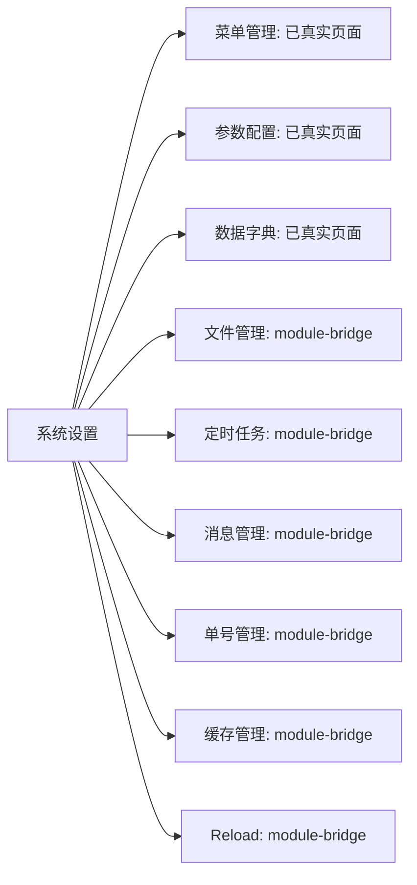

## 页面分型与 API 拆分

### 页面分型

- 标准管理页族：`文件管理 / 定时任务 / 消息管理`
  - 采用 `ArtSearchPanel + ArtTablePanel + ArtTableHeader + ArtTable`
  - 复杂动作放在 `Dialog` 或 `Drawer`，不拆新路由
- 工具操作页族：`单号管理 / 缓存管理 / Reload`
  - 以后端工具接口为真，不强行套“新增/编辑/删除”式 CRUD
  - 采用“主列表 + 右侧抽屉/结果面板”承接次级信息，保持父列表上下文

### API 文件拆分

前端按模块拆分独立 `api/system/*.ts`，保持与现有 `menu.ts / config.ts / dict.ts` 一致：

- `api/system/file.ts`
- `api/system/job.ts`
- `api/system/message.ts`
- `api/system/serial-number.ts`
- `api/system/cache.ts`
- `api/system/reload.ts`

这样可以保证：

- DTO / QueryForm / MutationForm 与后端 `form`、`vo`、`entity` 一一对应
- 单模块联调时更容易定位接口问题
- 后续页面测试可按模块落地，不必维护一个超大聚合 API 文件

## 模块逐项设计

### 1. 菜单管理

职责：

- 维护菜单树、路由路径、组件路径、权限码、显示/禁用状态。
- 作为后续 `support/*` 页面命中真实路由的基线样例。

当前状态：

- 已有真实页面 `views/system/menu/menu-list.vue`
- 已有独立 API 文件 `api/system/menu.ts`

流程图：

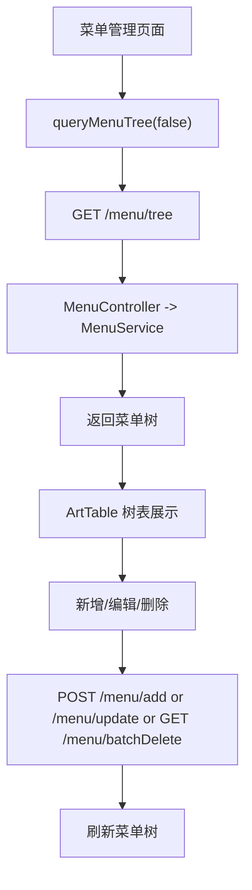

第一版边界：

- 保持现状，不扩 scope。
- 仅作为其余模块的页面结构与 API 分层参考。

### 2. 参数配置

职责：

- 作为标准单表 CRUD 列表页。
- 查询并维护 `configKey/configName/configValue/remark`。

核心接口：

- `POST /config/query`
- `POST /config/add`
- `POST /config/update`

核心字段：

- `ConfigVO.configId`
- `ConfigVO.configKey`
- `ConfigVO.configName`
- `ConfigVO.configValue`
- `ConfigVO.remark`

流程图：

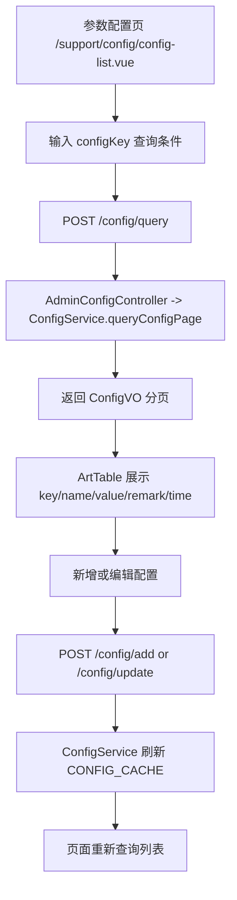

第一版边界：

- 页面形态保持 `ArtSearchPanel + ArtTable + Dialog Form`。
- `configValue` 第一版使用普通多行输入，不额外做 JSON 可视化编辑器。

### 3. 数据字典

职责：

- 维护字典主表与字典项子表。
- 支持字典启停、字典项启停、增删改。

核心接口：

- `POST /dict/queryPage`
- `POST /dict/add`
- `POST /dict/update`
- `GET /dict/updateDisabled/{dictId}`
- `GET /dict/delete/{dictId}`
- `GET /dict/dictData/queryDictData/{dictId}`
- `POST /dict/dictData/add`
- `POST /dict/dictData/update`
- `GET /dict/dictData/updateDisabled/{dictDataId}`
- `GET /dict/dictData/delete/{dictDataId}`

核心字段：

- 主表：`dictId/dictName/dictCode/remark/disabledFlag`
- 子表：`dictDataId/dataValue/dataLabel/dataStyle/sortOrder/disabledFlag`

流程图：

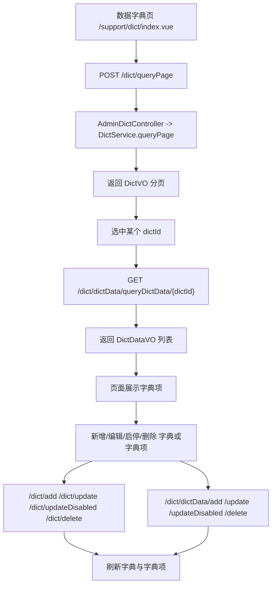

第一版边界：

- 先完成字典主表 + 字典项列表/表单闭环。
- 不做拖拽排序、批量导入、复杂样式编辑器。

### 4. 文件管理

职责：

- 展示后端已上传文件记录。
- 支持查询、查看 URL、下载。
- 第一版以后端已有“查询与使用现有文件”能力为主，不主动扩成上传工作台。

核心接口：

- `POST /file/queryPage`
- `POST /file/upload`
- `GET /file/getFileUrl`
- `GET /file/downLoad`

核心字段：

- `fileId/folderType/fileName/fileType/fileSize/fileKey/creatorName/fileUrl/createTime`

流程图：

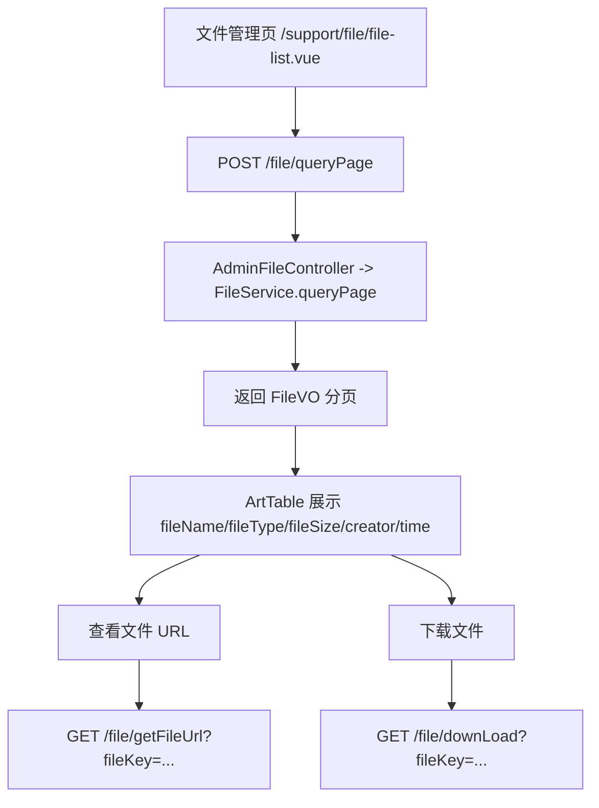

第一版边界：

- 以“查询和使用现有文件”为主。
- 不扩展成素材中心或复杂预览中心。
- `POST /file/upload` 保留在 API 设计中，但不作为第一版页面主路径。

### 5. 定时任务

职责：

- 查询任务、查看详情、启停、手动执行、编辑、删除、查看执行日志。

核心接口：

- `POST /job/query`
- `GET /job/{jobId}`
- `POST /job/add`
- `POST /job/update`
- `POST /job/update/enabled`
- `POST /job/execute`
- `GET /job/delete`
- `POST /job/log/query`

核心字段：

- 主表：`jobId/jobName/jobClass/triggerType/triggerValue/enabledFlag/remark/sort`
- 日志：`logId/jobId/successFlag/executeStartTime/executeEndTime/executeResult`

流程图：

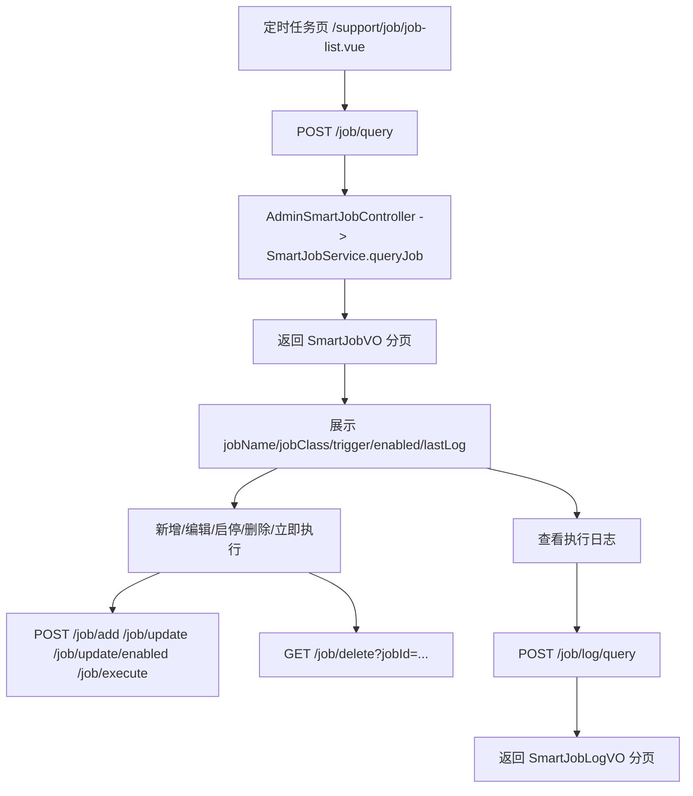

第一版边界：

- 先完成列表、启停、立即执行、日志查看闭环。
- `nextJobExecuteTimeList` 作为详情补充信息，不要求第一版复杂呈现。
- 新增/编辑任务使用页面内弹窗，不拆独立编辑路由。

### 6. 消息管理

职责：

- 面向后管的消息列表、发送消息、删除消息。
- 与“我的消息”区分开，菜单页优先对接 admin `/message/query`。

核心接口：

- `POST /message/query`
- `POST /message/sendMessages`
- `GET /message/delete/{messageId}`

辅助基础接口：

- `POST /message/queryMyMessage`
- `GET /message/getUnreadCount`
- `GET /message/read/{messageId}`

核心字段：

- `messageId/messageType/receiverUserType/receiverUserId/title/content/readFlag/createTime`

流程图：

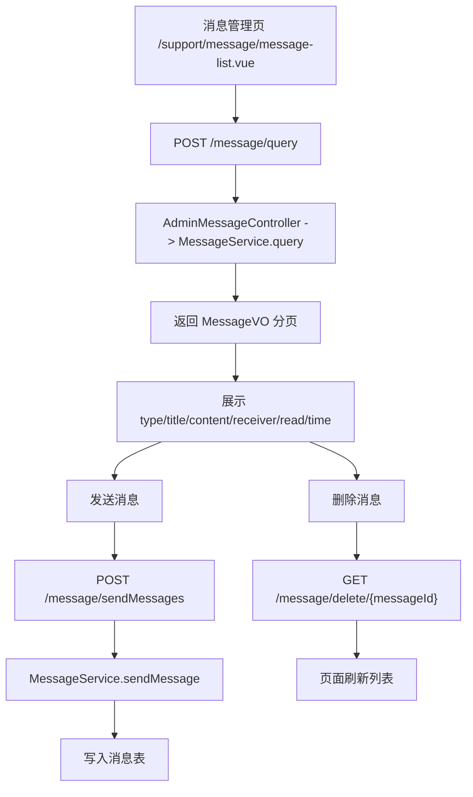

第一版边界：

- 仅做 admin 消息管理，不混入“我的消息”工作台逻辑。
- 发送消息先做最小表单，不做模板消息编排器。
- 发送能力先按单条消息表单落地，前端内部可按接口要求封装成单元素数组提交。

### 7. 单号管理

职责：

- 查看单号定义。
- 查看生成记录。
- 支持手动生成测试单号。

核心接口：

- `GET /serialNumber/all`
- `POST /serialNumber/queryRecord`
- `POST /serialNumber/generate`

核心字段：

- 定义：`serialNumberId/businessName/format/ruleType/initNumber/lastNumber/lastTime`
- 记录：`serialNumberId/recordDate/lastNumber/count/lastTime`

流程图：

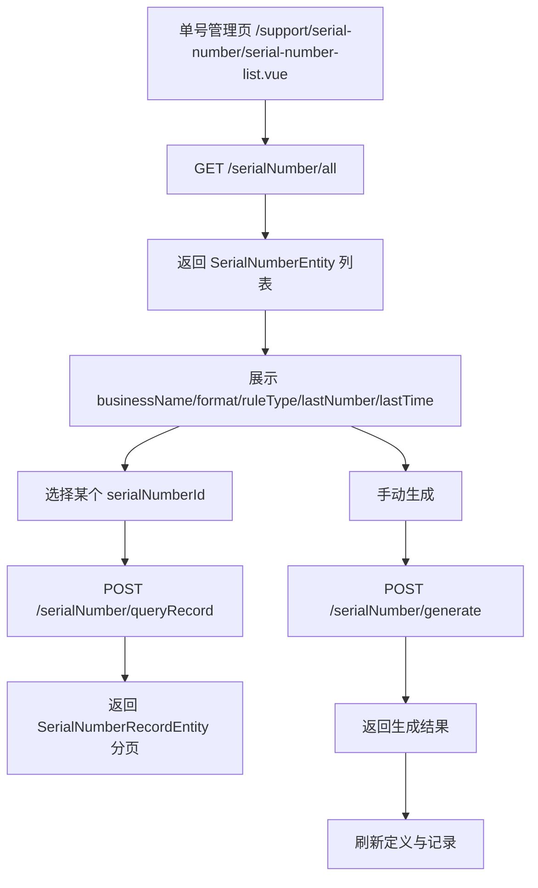

第一版边界：

- 以“查看定义 + 查看记录 + 手动生成验证”为主。
- 不开放前端编辑单号规则。
- 生成记录通过右侧抽屉承接，避免把页面做成永久双栏。

### 8. 缓存管理

职责：

- 查看缓存名称。
- 查看某个缓存下的 key。
- 删除某个缓存。

核心接口：

- `GET /cache/names`
- `GET /cache/keys/{cacheName}`
- `GET /cache/remove/{cacheName}`

流程图：

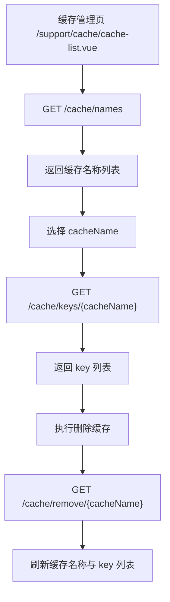

第一版边界：

- 只做安全、可确认的运维工具页。
- 不做“清空全部缓存”这类高风险快捷动作。
- `cache key` 明细通过抽屉展示，不做单独子路由。

### 9. Reload

职责：

- 查看 reload tag 列表。
- 修改某个 tag 的 `identification/args`。
- 查看执行结果历史。

核心接口：

- `GET /reload/query`
- `POST /reload/update`
- `GET /reload/result/{tag}`

核心字段：

- 列表：`tag/args/identification/updateTime`
- 结果：`tag/args/result/exception/createTime`

流程图：

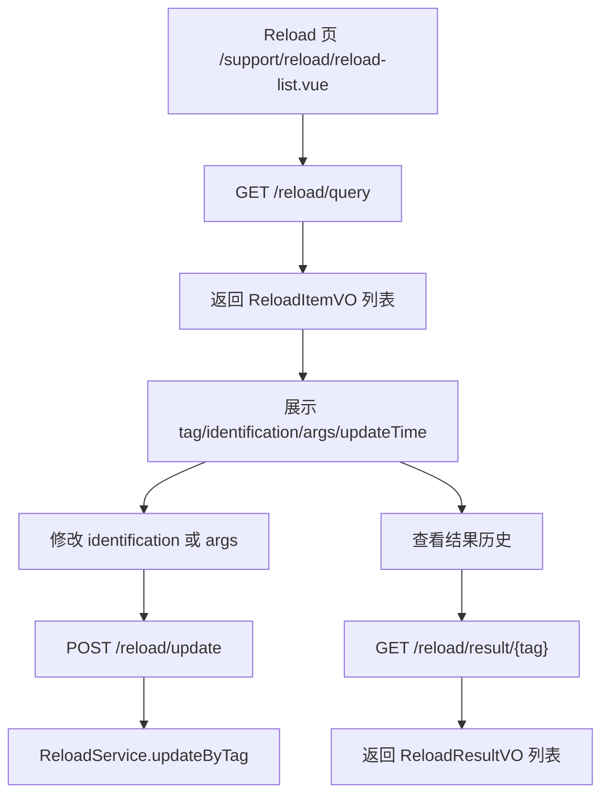

第一版边界：

- 定位为运维工具页，不做过多视觉包装。
- 更新动作必须有明确确认提示。
- 结果历史通过抽屉展示，保持主列表上下文稳定。

## 推荐实施顺序

### 基线验证批

1. 菜单管理
2. 参数配置
3. 数据字典

原因：

- 这 3 个页面已是系统设置的现有基线。
- 后续新增页面要优先对齐这一组的页面密度、查询节奏和接口分层。

### 第一批

1. 文件管理
2. 消息管理

原因：

- 都是“查询为主 + 少量动作”的标准管理页。
- 接口清晰，适合先沉淀 `support` 页通用对接方式。

### 第二批

1. 定时任务

原因：

- 同时包含任务主表、启停、立即执行、日志查看与编辑动作。
- 交互复杂度明显高于普通管理页，单独成批更稳妥。

### 第三批

1. 单号管理
2. 缓存管理
3. Reload

原因：

- 更偏工具/运维页面。
- 这三页都不应被强行做成标准 CRUD，适合作为一组统一收口。

### 批次图


## 验证策略

### 路由验证

- 登录后，这些菜单需要从 `module-bridge` 逐个切换为真实页面命中。
- 不修改数据库路径约定，只补本地真实 `views` 页面。

### 页面规范验证

- 所有列表页遵循 `docs/frontend-list-table-page-standard.md`。
- 不添加多余 hero/title/desc 页面介绍块。
- 单行搜索条件默认关闭 collapse。

### 分层验证

- `views/support/*` 只承接页面层逻辑。
- `api/system/*.ts` 统一承接 DTO 和接口请求。
- 共享组件不直接依赖业务接口。

### 命令验证

第一优先验证命令：

```bash
pnpm --dir hunyuan-design -F @vben/web-ele run typecheck
```

若补充了页面结构约束或模块命中验证测试，再补对应 `vitest` 校验：

```bash
pnpm --dir hunyuan-design test:unit -- apps/hunyuan-system/src/views/system/organization-modules.test.ts
```

## 成功标准

- 系统设置菜单组的真实路径、真实页面状态、后端接口面全部梳理清楚。
- 设计文档可以直接指导后续单模块实现。
- 第一批模块具备明确的页面职责、流程图和验证路径。
- 后续实现时无需再重新发明路径、接口边界和页面结构。
