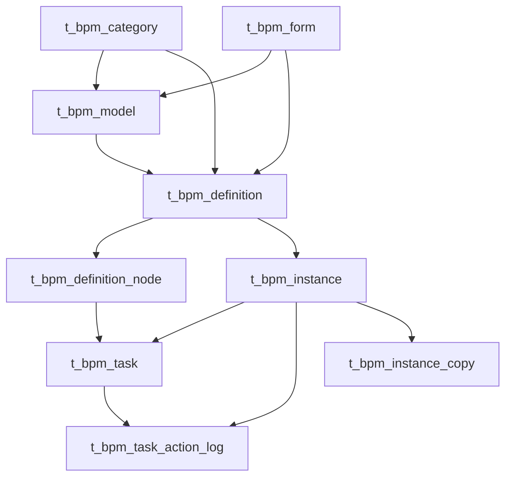

# BPM 流程引擎底座设计

## 背景

当前 `hunyuan-pro` 后端聚合器仍然保持较干净的基础结构，`hunyuan-backend` 目前只聚合 `hunyuan-base` 与 `hunyuan-admin` 两个模块，适合作为新的独立基础能力模块继续扩展，而不是把流程能力散落到现有模块中。

当前项目的运行主体是员工体系，登录态核心身份为 `employeeId`，并且天然挂接 `departmentId`。这意味着流程运行态、审批人、抄送人、发起人都应以员工体系建模，而不是复用一套抽象用户中心。

参考仓 `ruoyi-vue-pro-master` 中已经存在较完整的 BPM 模块面，包括分类、表单、模型、定义、实例、任务等能力，可作为对照样本。但本次设计不做机械照搬，而是吸收其“模块完整、快照分层、SimpleModel 驱动”这些优点，去掉对当前仓不合适的部分。

本设计采用 Karpathy 风格的 understanding-first 原则：

- 不直接复制参考仓实现
- 优先钉死真相层边界
- 先设计 authoring / publish / runtime 三层，再考虑实现细节
- 先让 P0 可闭环，再为 P1/P2 预留演进缝

## 目标

本次 P0 目标是为 `hunyuan-pro` 增加一个独立的 BPM 底座模块，形成与当前用户体系、组织体系、消息体系、编号体系能够自然协作的流程基础能力。

P0 需要满足以下目标：

1. 流程能力以独立模块 `hunyuan-bpm` 接入，而不是分散到 `hunyuan-base` 或 `hunyuan-admin`
2. 对外形成完整 BPM 模块面：分类、表单、设计器、模型、定义、实例、任务、监听器
3. 设计层采用 `simpleModel JSON -> validate/simulate -> compile BPMN -> publish snapshot -> run`
4. 运行层 actor 统一使用员工体系
5. 定义、表单、节点语义都运行于发布快照，而不是运行时回头读草稿
6. 任务中心、实例中心、时间线、抄送页都能以平台投影方式高效查询
7. P0 全闭环只支持 schema 型表单
8. P0 监听器只支持通知型监听器，复用站内信、短信、邮件能力

## 非目标

本次 P0 明确不做以下事情：

- 不以通用 BPMN 画布作为 P0 主设计入口
- 不开放 class/expression/http 形式的通用监听器执行能力
- 不开放多人会签、通过比例、复杂并行审批等高级审批语义
- 不支持 position、上级链、多级主管等复杂 candidate resolver
- 不支持自定义页面型表单闭环
- 不在 P0 增加 listener 模板表
- 不在 P0 拆 form version 表
- 不在 P0 改造现有员工、部门、角色基础模型
- 不在 P0 把 BPM 与具体业务模块做强耦合绑定

## 全局约束

- 遵循 `AGENTS.md`：一次只推进一个可验证增量
- 遵循 `AGENTS.md`：优先使用现有项目模式，不新增依赖
- P0 接受真实流程引擎存在，但流程引擎只能作为 `hunyuan-bpm` 内部实现
- 后端 actor 一律使用 `employeeId`
- 当前仓的组织解析能力以 `department`、`role` 为 P0 主路径
- 表单真相使用 BPM 自带表单中心，不复用系统字典充当表单仓库
- 表单提交真相分为两份：
  - `initial_form_data_snapshot_json`：首次提交审计真相
  - `current_form_data_snapshot_json`：当前继续流转所用数据
- 变量只允许白名单映射，不允许整包表单数据直接灌入 runtime variables
- 运行态不再复制第二套“流程引擎真相”，平台表只保存读模型、快照与审计补位

## 方案比较

### 方案 A：直接镜像参考仓

优点：

- 能较快覆盖模块面
- 参考实现路径最清晰

缺点：

- 会把当前仓拖入参考仓的内部形态
- 很多能力超出当前仓 P0 所需
- authoring、publish、runtime 三层边界不够贴合当前项目

### 方案 B：极简审批流

优点：

- 上线快
- 表结构和 API 数量最少

缺点：

- 模块面不完整
- 无法承接后续设计器、定义历史、任务中心、审计时间线演进
- 很快会出现“补洞式”返工

### 方案 C：独立 BPM 底座，SimpleModel 驱动，发布快照运行

优点：

- 最符合当前仓底座能力定位
- 模块完整但复杂度可控
- authoring / publish / runtime 分层清晰
- 能吸收参考仓优点，同时去掉不适合当前仓的部分

缺点：

- 设计前置工作比极简审批流更重
- 需要先把快照与投影边界讲清楚

### 推荐方案

推荐采用 **方案 C：独立 BPM 底座，SimpleModel 驱动，发布快照运行**。

## 总体架构

P0 推荐在 `hunyuan-backend` 下新增独立模块：

- `hunyuan-bpm`

该模块的定位不是业务审批中心，而是流程底座。它与现有模块的边界如下：

- `hunyuan-base`
  - 提供基础能力：消息、短信、邮件、编号规则、缓存、通用支持能力
- `hunyuan-admin`
  - 提供系统主体数据：员工、部门、角色、职务、菜单、权限
- `hunyuan-bpm`
  - 提供 BPM 领域能力：表单、模型、定义、实例、任务、时间线、抄送、监听器配置

推荐的设计分层：

1. Authoring 层
   - `bpm_form`
   - `bpm_model`
   - SimpleModel JSON
2. Publish 层
   - `bpm_definition`
   - `bpm_definition_node`
   - compiled BPMN XML
3. Runtime 层
   - 引擎 runtime / history 真相
   - 平台投影表：`bpm_instance`、`bpm_task`
   - 审计补位表：`bpm_task_action_log`、`bpm_instance_copy`

## 流程内核策略

P0 接受“真实流程内核存在”这一事实，不走自研轻状态机路线。否则 `simpleModel JSON -> compile BPMN -> publish snapshot -> run` 这条主线会退化成伪闭环。

P0 的首发候选内核可以参考 `ruoyi-vue-pro-master` 采用 Flowable 的经验，但这里的“参考”只针对能力面与演进路径，不针对其具体版本、配置方式或对外暴露形态做机械继承。

P0 对流程内核的硬约束如下：

- 流程引擎只允许存在于 `hunyuan-bpm` 模块内部
- `hunyuan-base`、`hunyuan-admin`、未来业务模块都不直接依赖引擎原生类型
- 管理端 API、员工端 API、跨模块服务契约不直接暴露引擎原生对象
- 平台对外公开语言统一使用：
  - `bpm_model`
  - `bpm_definition`
  - `bpm_definition_node`
  - `bpm_instance`
  - `bpm_task`
  - `bpm_task_action_log`
  - `bpm_instance_copy`
- 引擎原生 `Model / ProcessDefinition / ProcessInstance / Task` 只允许在 `hunyuan-bpm` 内部适配层和运行协调层出现
- 发布快照、任务投影、实例投影仍以平台表为主，不以引擎表充当系统公开真相

这意味着：

- 我们对齐参考仓的是“完整 BPM 模块面 + 快照分层 + SimpleModel 驱动”
- 我们不对齐参考仓的，是其具体引擎版本、启动方式、以及引擎对象直接参与上层契约的实现细节
- 后续实现计划必须单列一项：验证当前 `Spring Boot 3 + Java 17` 环境下的引擎兼容策略

## 用户与组织模型

P0 的身份与组织规则如下：

- 发起人：`employeeId`
- 审批人：`employeeId`
- 抄送人：`employeeId`
- 发起部门：`departmentId`
- P0 candidate resolver：
  - `EMPLOYEE`
  - `DEPARTMENT_MANAGER`
  - `ROLE`
- P0 不推荐：
  - `POSITION`
  - 领导链
  - 上上级
  - 多级汇报链

P0 审批模式统一约束为：

- 单人审批 `single only`

这意味着即使 schema 或 compiled snapshot 为未来扩展预留字段，P0 validator 仍只允许单人审批通过。

## 设计器策略

P0 不把 BPMN 画布作为主入口，而是采用 SimpleModel 驱动。

推荐链路：

1. 设计器编辑 `simpleModel JSON`
2. 后端执行校验与模拟
3. 编译为 BPMN XML
4. 发布为 definition snapshot
5. 引擎启动与流转

这样做的收益是：

- authoring 语言可控
- validator 可以收紧 P0 范围
- compiled BPMN 成为发布产物，而不是作者真相

## 表单策略

P0 正式引入 BPM 自带表单中心，表单真相单独落库在 `bpm_form`。

P0 表单约束如下：

- 只支持 schema 型表单
- 前端复用当前仓现有 schema-form 协议
- definition 发布时快照表单名称与 schema
- runtime 不回头读草稿表单

P0 不拆 `bpm_form_version`。发布时由 `bpm_definition` 保存表单快照，先满足运行闭环。

## 监听器策略

监听器在 P0 有完整模块面，但不独立成模板表。

P0 监听器能力：

- 设计器中可配置监听器
- 发布时进入节点 compiled snapshot
- 运行时只允许通知型监听器
- 渠道复用：
  - 站内信
  - 短信
  - 邮件

P0 不支持：

- class listener
- expression listener
- 通用 HTTP 回调执行器
- 脚本执行器

P0 监听器配置承载位置：

- `bpm_model.simple_model_json`
- `bpm_definition_node.compiled_node_snapshot_json`

## 9 表模型

P0 核心持久化采用 9 张表。

### t_bpm_category

职责：

- 流程分类治理真相

字段建议：

- `category_id bigint`，主键，自增
- `category_code varchar(64)`，必填，唯一
- `category_name varchar(128)`，必填
- `icon varchar(255)`，可空
- `sort int`，必填，默认 0
- `disabled_flag tinyint(1)`，必填，默认 0
- `remark varchar(500)`，可空
- `deleted_flag tinyint(1)`，必填，默认 0
- `create_time datetime`，必填
- `update_time datetime`，必填

索引与约束：

- `uk_category_code(category_code)`
- `idx_category_enabled_sort(disabled_flag, sort)`

### t_bpm_form

职责：

- BPM 表单注册真相

字段建议：

- `form_id bigint`，主键，自增
- `form_key varchar(64)`，必填，唯一
- `form_name varchar(128)`，必填
- `schema_json longtext`，必填
- `layout_json longtext`，可空
- `disabled_flag tinyint(1)`，必填，默认 0
- `remark varchar(500)`，可空
- `deleted_flag tinyint(1)`，必填，默认 0
- `create_time datetime`，必填
- `update_time datetime`，必填

索引与约束：

- `uk_form_key(form_key)`
- `idx_form_name(form_name)`
- `idx_form_enabled(disabled_flag)`

### t_bpm_model

职责：

- 流程设计草稿真相

字段建议：

- `model_id bigint`，主键，自增
- `model_key varchar(64)`，必填，唯一
- `model_name varchar(128)`，必填
- `category_id bigint`，必填
- `form_type tinyint`，必填，P0 固定为 schema 表单
- `form_id bigint`，必填
- `visible_flag tinyint(1)`，必填，默认 1
- `sort int`，必填，默认 0
- `description varchar(500)`，可空
- `simple_model_json longtext`，必填
- `start_rule_json longtext`，必填
- `manager_scope_json longtext`，可空
- `title_rule_json longtext`，可空
- `summary_rule_json longtext`，可空
- `variable_mapping_json longtext`，可空
- `instance_no_rule_id int`，可空，复用现有码规则能力
- `published_definition_id bigint`，可空
- `has_unpublished_changes tinyint(1)`，必填，默认 0
- `deleted_flag tinyint(1)`，必填，默认 0
- `create_time datetime`，必填
- `update_time datetime`，必填

索引与约束：

- `uk_model_key(model_key)`
- `idx_model_category(category_id)`
- `idx_model_form(form_id)`
- `idx_model_published(published_definition_id)`

### t_bpm_definition

职责：

- 发布快照真相
- 每次发布形成一条不可变 definition

字段建议：

- `definition_id bigint`，主键，自增
- `model_id bigint`，必填
- `definition_key varchar(64)`，必填
- `definition_name varchar(128)`，必填
- `definition_version int`，必填
- `category_id_snapshot bigint`，必填
- `category_name_snapshot varchar(128)`，必填
- `form_type_snapshot tinyint`，必填
- `form_id_snapshot bigint`，必填
- `form_name_snapshot varchar(128)`，必填
- `form_schema_snapshot_json longtext`，必填
- `simple_model_snapshot_json longtext`，必填
- `compiled_bpmn_xml longtext`，必填
- `start_rule_snapshot_json longtext`，必填
- `manager_scope_snapshot_json longtext`，可空
- `title_rule_snapshot_json longtext`，可空
- `summary_rule_snapshot_json longtext`，可空
- `variable_mapping_snapshot_json longtext`，可空
- `instance_no_rule_id_snapshot int`，可空
- `lifecycle_state tinyint`，必填
- `start_state tinyint`，必填
- `engine_process_definition_id varchar(128)`，必填
- `published_by_employee_id bigint`，必填
- `published_by_name_snapshot varchar(64)`，必填
- `published_at datetime`，必填
- `create_time datetime`，必填
- `update_time datetime`，必填

索引与约束：

- `uk_definition_key_version(definition_key, definition_version)`
- `idx_definition_model(model_id)`
- `idx_definition_engine(engine_process_definition_id)`
- `idx_definition_current(definition_key, lifecycle_state, start_state)`

### t_bpm_definition_node

职责：

- 定义级节点语义快照
- 保存发布后的节点编译结果

字段建议：

- `definition_node_id bigint`，主键，自增
- `definition_id bigint`，必填
- `node_key varchar(128)`，必填
- `node_type varchar(32)`，必填
- `node_name_snapshot varchar(128)`，可空
- `sort_order int`，必填，默认 0
- `authored_rule_snapshot_json longtext`，必填
- `compiled_node_snapshot_json longtext`，必填
- `create_time datetime`，必填
- `update_time datetime`，必填

索引与约束：

- `uk_definition_node(definition_id, node_key)`
- `idx_definition_node_sort(definition_id, sort_order)`

说明：

- `compiled_node_snapshot_json` 内承载 P0 监听器配置
- 本表不保存运行时处理人、不保存审批意见、不保存任务结果

### t_bpm_instance

职责：

- 实例平台投影

字段建议：

- `instance_id bigint`，主键，自增
- `instance_no varchar(64)`，必填，唯一
- `definition_id bigint`，必填
- `engine_process_definition_id varchar(128)`，必填
- `engine_process_instance_id varchar(128)`，必填
- `definition_key_snapshot varchar(64)`，必填
- `definition_version_snapshot int`，必填
- `category_id_snapshot bigint`，必填
- `category_name_snapshot varchar(128)`，必填
- `title varchar(256)`，必填
- `summary varchar(1000)`，可空
- `start_employee_id bigint`，必填
- `start_employee_name_snapshot varchar(64)`，必填
- `start_department_id_snapshot bigint`，可空
- `start_department_name_snapshot varchar(128)`，可空
- `business_type varchar(64)`，可空
- `business_id bigint`，可空
- `business_key varchar(128)`，可空
- `initial_form_data_snapshot_json longtext`，必填
- `current_form_data_snapshot_json longtext`，必填
- `run_state tinyint`，必填
- `result_state tinyint`，可空
- `active_task_count int`，必填，默认 0
- `current_node_summary_json longtext`，可空
- `cancel_by_employee_id bigint`，可空
- `cancel_by_name_snapshot varchar(64)`，可空
- `cancel_reason varchar(500)`，可空
- `started_at datetime`，必填
- `last_action_at datetime`，必填
- `finished_at datetime`，可空
- `cancelled_at datetime`，可空
- `create_time datetime`，必填
- `update_time datetime`，必填

索引与约束：

- `uk_instance_no(instance_no)`
- `idx_instance_definition(definition_id)`
- `idx_instance_start(start_employee_id, run_state)`
- `idx_instance_business(business_type, business_id)`
- `idx_instance_engine(engine_process_instance_id)`

说明：

- `initial_form_data_snapshot_json` 永不覆盖
- `current_form_data_snapshot_json` 在 `return-to-initiator` 后允许更新

### t_bpm_task

职责：

- 任务平台投影

字段建议：

- `task_id bigint`，主键，自增
- `instance_id bigint`，必填
- `definition_id bigint`，必填
- `definition_node_id bigint`，必填
- `engine_task_id varchar(128)`，必填，唯一
- `engine_execution_id varchar(128)`，可空
- `engine_process_instance_id varchar(128)`，必填
- `task_key varchar(128)`，必填
- `task_name varchar(128)`，必填
- `instance_no varchar(64)`，必填
- `instance_title varchar(256)`，必填
- `start_employee_id bigint`，必填
- `start_employee_name_snapshot varchar(64)`，必填
- `category_id_snapshot bigint`，必填
- `category_name_snapshot varchar(128)`，必填
- `assignee_employee_id bigint`，可空
- `assignee_name_snapshot varchar(64)`，可空
- `assignee_department_id_snapshot bigint`，可空
- `assignee_department_name_snapshot varchar(128)`，可空
- `runtime_assignment_snapshot_json longtext`，可空
- `task_state tinyint`，必填
- `task_result tinyint`，可空
- `assigned_at datetime`，必填
- `due_at datetime`，可空
- `completed_at datetime`，可空
- `cancelled_at datetime`，可空
- `last_action_at datetime`，必填
- `create_time datetime`，必填
- `update_time datetime`，必填

索引与约束：

- `uk_engine_task(engine_task_id)`
- `idx_task_instance(instance_id)`
- `idx_task_assignee(assignee_employee_id, task_state)`
- `idx_task_node(definition_node_id)`
- `idx_task_assigned(assigned_at)`

### t_bpm_task_action_log

职责：

- 统一动作时间线

字段建议：

- `action_log_id bigint`，主键，自增
- `instance_id bigint`，必填
- `task_id bigint`，可空
- `definition_id bigint`，必填
- `definition_node_id bigint`，可空
- `engine_task_id varchar(128)`，可空
- `action_type varchar(32)`，必填
- `actor_employee_id bigint`，必填
- `actor_name_snapshot varchar(64)`，必填
- `from_assignee_employee_id bigint`，可空
- `to_assignee_employee_id bigint`，可空
- `comment_text varchar(2000)`，可空
- `action_payload_json longtext`，可空
- `action_at datetime`，必填
- `create_time datetime`，必填

索引与约束：

- `idx_log_instance(instance_id, action_at)`
- `idx_log_task(task_id, action_at)`
- `idx_log_actor(actor_employee_id, action_at)`

动作类型建议：

- `CREATED`
- `APPROVED`
- `REJECTED`
- `RETURNED_TO_INITIATOR`
- `TRANSFERRED`
- `RESUBMITTED`
- `INSTANCE_CANCELLED`

### t_bpm_instance_copy

职责：

- 抄送读模型

字段建议：

- `copy_id bigint`，主键，自增
- `instance_id bigint`，必填
- `definition_id bigint`，必填
- `definition_node_id bigint`，可空
- `engine_process_instance_id varchar(128)`，必填
- `source_node_key varchar(128)`，必填
- `source_node_name varchar(128)`，可空
- `target_employee_id bigint`，必填
- `target_name_snapshot varchar(64)`，必填
- `copy_type varchar(32)`，必填
- `read_state tinyint`，必填，默认 0
- `channel_snapshot_json longtext`，可空
- `reason_snapshot varchar(500)`，可空
- `sent_at datetime`，必填
- `read_at datetime`，可空
- `create_time datetime`，必填
- `update_time datetime`，必填

索引与约束：

- `idx_copy_target(target_employee_id, read_state, sent_at)`
- `idx_copy_instance(instance_id)`

## 状态枚举

P0 状态建议如下：

- `category.disabled_flag`
  - `0` 启用
  - `1` 禁用
- `form.disabled_flag`
  - `0` 启用
  - `1` 禁用
- `definition.lifecycle_state`
  - `1 CURRENT`
  - `2 HISTORICAL`
- `definition.start_state`
  - `1 STARTABLE`
  - `2 SUSPENDED`
- `instance.run_state`
  - `1 RUNNING`
  - `2 WAIT_RESUBMIT`
  - `3 FINISHED`
  - `4 CANCELLED`
- `instance.result_state`
  - `1 APPROVED`
  - `2 REJECTED`
  - `3 CANCELLED_BY_START_USER`
  - `4 CANCELLED_BY_ADMIN`
- `task.task_state`
  - `1 PENDING`
  - `2 COMPLETED`
  - `3 CANCELLED`
- `task.task_result`
  - `1 APPROVED`
  - `2 REJECTED`
  - `3 RETURNED`
  - `4 INSTANCE_CANCELLED`
- `copy.read_state`
  - `0 UNREAD`
  - `1 READ`

## 模块面与 API 面

P0 对外模块面建议如下：

1. 分类模块
2. 表单模块
3. 设计器模块
4. 模型模块
5. 定义模块
6. 实例模块
7. 任务模块
8. 监听器模块

建议按领域切 API，而不是按页面或引擎原生对象切。

### 管理端 API

- `/admin/bpm/category/*`
- `/admin/bpm/form/*`
- `/admin/bpm/designer/*`
- `/admin/bpm/model/*`
- `/admin/bpm/definition/*`
- `/admin/bpm/instance/*`
- `/admin/bpm/task/*`
- `/admin/bpm/listener/*`

### 员工端 API

- `/app/bpm/startable`
- `/app/bpm/my-instance`
- `/app/bpm/my-todo`
- `/app/bpm/my-done`

## 关键业务语义

### 发布语义

- 每次发布生成一条新的 `definition`
- 老版本 definition 进入 `HISTORICAL`
- 当前版本可 `STARTABLE` 或 `SUSPENDED`
- 不允许直接修改已发布 definition 的快照内容

### 退回发起人语义

`return-to-initiator` 与 `reject` 必须区分：

- `reject`
  - 表示拒绝或按拒绝策略终止
- `return-to-initiator`
  - 表示实例继续存活
  - `instance.run_state = WAIT_RESUBMIT`
  - 当前任务 `task_result = RETURNED`
  - 发起人修订后写入 `current_form_data_snapshot_json`
  - `initial_form_data_snapshot_json` 不变
  - `task_action_log` 追加 `RESUBMITTED`

### 变量语义

- 表单快照是审计真相
- runtime variables 只是引擎燃料
- 只允许白名单映射，不允许整表单灌入引擎变量

## 与现有基础能力的关系

### 复用现有能力

- 员工/部门/角色：复用 `hunyuan-admin`
- 消息/短信/邮件：复用 `hunyuan-base`
- 实例编号：复用现有码规则能力

### 不复用的部分

- 不用字典表充当 BPM 分类表
- 不用系统配置表充当 BPM 表单中心
- 不用业务模块表充当 BPM 实例真相

## P0 / P1 边界

### P0

- 独立 BPM 模块
- 9 张核心表
- schema 表单
- SimpleModel 设计器主路径
- 单人审批
- 通知型监听器
- 分类、表单、模型、定义、实例、任务、抄送、时间线完整闭环

### P1

- listener 模板表
- form version 表
- position / leader chain resolver
- 多人审批
- 更复杂的并行审批策略
- 自定义页面型表单

## 风险与约束

1. 如果 P0 就引入多审批模式，会直接放大 validator、compiled snapshot、任务投影复杂度
2. 如果不引入 `bpm_form`，表单真相会缺位，definition snapshot 无法闭环
3. 如果让 instance/task 复制引擎全部真相，后续状态漂移修复成本会很高
4. 如果 listener 在 P0 开放通用执行器，会把底座能力升级成脚本执行平台，风险过高
5. 如果引擎原生对象泄漏到模块边界之外，后续版本升级、替换内核、投影修复都会被放大

## 验收标准

本设计稿成立后，后续实现必须满足：

1. `hunyuan-bpm` 作为独立模块接入
2. 流程运行 actor 统一使用员工体系
3. 分类、表单、模型、定义、实例、任务、监听器都有明确模块入口
4. 表单、定义、节点都以发布快照运行
5. `return-to-initiator` 闭环可保留首次提交真相与修订后真相
6. 实例、任务、时间线、抄送都可通过平台投影表高效查询
7. P0 不新增 listener 模板表与 form version 表
8. 现有码规则、消息、短信、邮件能力被复用，而不是重复建设
9. 引擎原生类型不外溢到 `hunyuan-bpm` 之外的模块和公开 API

## 实施顺序建议

推荐后续按以下顺序进入实现计划：

1. 先验证当前 `Spring Boot 3 + Java 17` 环境下的流程引擎兼容策略
2. 建立 `hunyuan-bpm` 模块边界与聚合器接入方式
3. 设计 9 张表 SQL 与实体
4. 完成分类、表单、模型、定义管理面
5. 完成 SimpleModel 校验、编译、发布链路
6. 完成实例、任务、动作时间线、抄送查询面
7. 接入通知型监听器
8. 最后进入员工侧入口与联调验证
