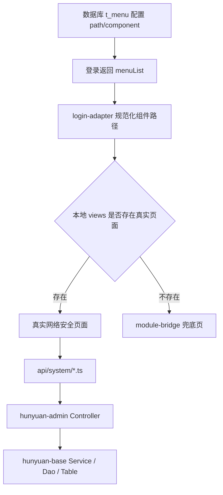

# 网络安全模块对接设计

## 背景

当前 `hunyuan-system` 已经具备真实登录、后端菜单加载、动态路由命中本地页面、以及 `module-bridge` 兜底能力。截图中的“网络安全”菜单已经在数据库 `t_menu` 中配置完成，但本地前端尚未提供对应页面文件，因此这些菜单目前仍会回落到桥接页，而不是进入真实业务页面。

这次任务不是直接无方向地补页面，而是先把网络安全模块拆解清楚，再按“点 -> 线 -> 面”的方式推进：

1. 先识别每个菜单项在后端的真实能力形态。
2. 再定义前后端对接顺序和页面落地方式。
3. 最后收敛成一个边界清晰、可分阶段实施的网络安全模块方案。

## 目标

本次设计只解决网络安全模块的前后端对接方式，不扩写后端能力范围：

1. 梳理网络安全 6 个菜单的真实后端接口、能力成熟度和页面类型。
2. 明确哪些菜单可以直接对接成管理页，哪些只能先落成能力演示页。
3. 定义前端目录、API 模块、页面职责、实施顺序和验证方式。
4. 为后续实现提供单模块、单增量、可验证的执行基线。

## 非目标

本次不做以下事项：

- 不新增新的网络安全数据库表或规则引擎。
- 不把 `接口加解密` 强行扩展成“规则配置中心”。
- 不把 `敏感数据脱敏` 强行扩展成“脱敏规则管理中心”。
- 不改登录主链、日志主链、脱敏底层实现、加解密底层实现。
- 不新增依赖。

## 全局约束

- 遵循 `AGENTS.md`：一次只推进一个可验证增量。
- 遵循 `AGENTS.md`：编辑前先解释为什么要改。
- 遵循 `AGENTS.md`：优先复用现有项目模式，不新造抽象，不新增依赖。
- 列表类页面遵循 `docs/frontend-list-table-page-standard.md`。
- 编辑/配置类页面遵循 `docs/frontend-edit-detail-page-standard.md`。
- 前端页面路径必须严格命中后端 `t_menu.component` 配置，不自造路径。
- 页面请求统一放在 `hunyuan-design/apps/hunyuan-system/src/api/system/*.ts`。
- 实施阶段优先使用 UTF-8。

## 当前证据

### 菜单与前端命中机制

网络安全菜单在数据库中已经配置完成，核心菜单路径如下：

- `三级等保设置` -> `/support/level3protect/level3-protect-config-index.vue`
- `接口加解密` -> `/support/api-encrypt/api-encrypt-index.vue`
- `敏感数据脱敏` -> `/support/level3protect/data-masking-list.vue`
- `登录失败锁定` -> `/support/login-fail/login-fail-list.vue`
- `登录登出记录` -> `/support/login-log/login-log-list.vue`
- `用户操作记录` -> `/support/operate-log/operate-log-list.vue`

`hunyuan-system` 登录后会通过 [login-adapter.ts](E:/my-project/hunyuan-pro/hunyuan-design/apps/hunyuan-system/src/api/core/login-adapter.ts:57) 规范化后端组件路径；若本地 `views` 中不存在对应页面，则自动回落到 [module-bridge/index.vue](E:/my-project/hunyuan-pro/hunyuan-design/apps/hunyuan-system/src/views/system/module-bridge/index.vue:1)。

因此，本次工作的核心不是改动态路由，而是补齐这些后端菜单声明对应的真实页面文件。

### 后端能力成熟度

网络安全 6 个菜单的后端成熟度并不一致：

1. `三级等保设置`
   - 已有 `GET /protect/level3protect/getConfig`
   - 已有 `POST /protect/level3protect/updateConfig`
   - 属于成熟的配置管理接口

2. `登录失败锁定`
   - 已有 `POST /protect/loginFail/queryPage`
   - 已有 `POST /protect/loginFail/batchDelete`
   - 属于成熟的列表管理接口

3. `登录登出记录`
   - 已有 `POST /loginLog/page/query`
   - 属于成熟的日志列表接口

4. `用户操作记录`
   - 已有 `POST /operateLog/page/query`
   - 已有 `GET /operateLog/detail/{operateLogId}`
   - 属于成熟的列表 + 详情接口

5. `接口加解密`
   - 当前只有 `/apiEncrypt/testRequestEncrypt`
   - `/apiEncrypt/testResponseEncrypt`
   - `/apiEncrypt/testDecryptAndEncrypt`
   - `/apiEncrypt/testArray`
   - 本质是测试/验证接口，而非配置接口

6. `敏感数据脱敏`
   - 当前只有 `GET /dataMasking/demo/query`
   - 本质是能力演示接口，而非脱敏规则管理接口

## 点：模块分型

网络安全模块第一步必须先分型，而不是把 6 个菜单都当成同一种“管理页”。

### A. 可直接落地的管理页

这 4 个菜单已经具备真实管理接口，可直接对接成生产意义明确的页面：

- `三级等保设置`
- `登录失败锁定`
- `登录登出记录`
- `用户操作记录`

### B. 只能先落地为能力页的菜单

这 2 个菜单当前没有对应的规则管理接口，只适合先按能力展示或验证台接入：

- `接口加解密`
- `敏感数据脱敏`

### 结论

当前“网络安全”不是一个成熟度一致的六联 CRUD 模块，而是：

- `4 个管理页`
- `2 个能力演示页`

后续实施必须接受这个现实边界，而不是让前端伪造一个后端尚不存在的管理系统。

## 线：前后端对接顺序

### 总体策略

沿用系统设置模块此前的做法：不修改后端菜单加载和动态路由机制，只通过补齐本地页面文件，使网络安全菜单自动从 `module-bridge` 切换为真实页面。

### 对接步骤

1. 先补 API 模块
   - 在 `apps/hunyuan-system/src/api/system/` 下补齐网络安全相关请求封装
   - 先把参数模型、返回模型、接口路径对齐后端

2. 再补页面文件
   - 页面路径严格对齐后端 `t_menu.component`
   - 不改后端菜单、不改 `login-adapter.ts`

3. 按成熟度顺序实施
   - 第一页：`三级等保设置`
   - 第二页：`登录失败锁定`
   - 第三页：`登录登出记录`
   - 第四页：`用户操作记录`
   - 最后补：`接口加解密`、`敏感数据脱敏`

### 为什么按这个顺序

- `三级等保设置` 是最稳定的配置编辑页，适合作为网络安全模块的第一块落地样板。
- `登录失败锁定`、`登录登出记录`、`用户操作记录` 都属于列表型页面，能复用同一套列表页标准。
- `接口加解密` 和 `敏感数据脱敏` 如果先做，很容易把“验证台”误做成“配置中心”。

## 面：模块整体结构

### 前端页面结构

按后端菜单路径精确落位：

- `hunyuan-design/apps/hunyuan-system/src/views/support/level3protect/level3-protect-config-index.vue`
- `hunyuan-design/apps/hunyuan-system/src/views/support/login-fail/login-fail-list.vue`
- `hunyuan-design/apps/hunyuan-system/src/views/support/login-log/login-log-list.vue`
- `hunyuan-design/apps/hunyuan-system/src/views/support/operate-log/operate-log-list.vue`
- `hunyuan-design/apps/hunyuan-system/src/views/support/api-encrypt/api-encrypt-index.vue`
- `hunyuan-design/apps/hunyuan-system/src/views/support/level3protect/data-masking-list.vue`

### 前端 API 结构

建议按能力拆分：

- `network-protect.ts`
  - `三级等保设置`
  - `登录失败锁定`
- `login-log.ts`
- `operate-log.ts`
- `api-encrypt.ts`
- `data-masking.ts`

### 页面类型定义

1. 配置页
   - `三级等保设置`
   - 页面目标：读取配置、编辑配置、保存配置

2. 列表管理页
   - `登录失败锁定`
   - `登录登出记录`
   - `用户操作记录`
   - 页面目标：筛选、分页、查看、必要时详情/批量处理

3. 能力演示页
   - `接口加解密`
   - `敏感数据脱敏`
   - 页面目标：展示已有基础能力、帮助验证效果，不伪装成规则管理页

## 方案比较

### 方案 A：先做成熟的 4 个管理页，剩余 2 个先做能力页

优点：

- 最符合后端当前真实能力
- 风险最小
- 容易形成一阶段闭环

缺点：

- 6 个菜单的页面语义不完全统一

### 方案 B：6 个菜单一起做成统一管理模块

优点：

- 表面上最整齐

缺点：

- 会把后端尚未具备的“规则管理”假装出来
- 风险高，容易返工

### 方案 C：先补后端，再统一接前端

优点：

- 未来形态最完整

缺点：

- 范围明显扩大
- 不符合当前“先对接已有能力”的目标

### 推荐方案

推荐采用 **方案 A**：

1. 第一阶段闭环成熟的 4 个管理页。
2. `接口加解密` 与 `敏感数据脱敏` 第一阶段先做能力页。
3. 等后端未来补齐规则管理接口后，再把这 2 个页面升级成管理页。

## 第一阶段页面设计

### 1. 三级等保设置

页面类型：

- 配置编辑页

后端接口：

- `GET /protect/level3protect/getConfig`
- `POST /protect/level3protect/updateConfig`

字段范围：

- `loginFailMaxTimes`
- `loginFailLockMinutes`
- `loginActiveTimeoutMinutes`
- `twoFactorLoginEnabled`
- `passwordComplexityEnabled`
- `regularChangePasswordMonths`
- `regularChangePasswordNotAllowRepeatTimes`
- `fileDetectFlag`
- `maxUploadFileSizeMb`

页面职责：

- 加载当前配置
- 按业务字段分组展示
- 编辑后保存

页面形态：

- 遵循 edit/detail 标准
- 保持安静、密集、以配置编辑为主

### 2. 登录失败锁定

页面类型：

- 列表管理页

后端接口：

- `POST /protect/loginFail/queryPage`
- `POST /protect/loginFail/batchDelete`

筛选字段：

- `loginName`
- `lockFlag`
- `loginLockBeginTimeBegin`
- `loginLockBeginTimeEnd`

展示字段：

- `loginFailId`
- `loginName`
- `loginFailCount`
- `lockFlag`
- `loginLockBeginTime`
- `createTime`
- `updateTime`

页面职责：

- 查询锁定记录
- 按登录名/锁定状态/时间筛选
- 对选中记录执行批量清理

### 3. 登录登出记录

页面类型：

- 日志列表页

后端接口：

- `POST /loginLog/page/query`

筛选字段：

- `userName`
- `ip`
- `startDate`
- `endDate`

展示字段：

- `userName`
- `userType`
- `loginIp`
- `loginIpRegion`
- `userAgent`
- `loginResult`
- `loginDevice`
- `remark`
- `createTime`

页面职责：

- 提供登录/登出审计查询入口
- 不承担编辑职责

### 4. 用户操作记录

页面类型：

- 列表页 + 详情抽屉/弹窗

后端接口：

- `POST /operateLog/page/query`
- `GET /operateLog/detail/{operateLogId}`

筛选字段：

- `userName`
- `keywords`
- `requestKeywords`
- `successFlag`
- `startDate`
- `endDate`

展示字段：

- `operateUserName`
- `module`
- `content`
- `url`
- `method`
- `ip`
- `ipRegion`
- `successFlag`
- `failReason`
- `createTime`

详情字段：

- `param`
- `response`
- `userAgent`
- 其余完整日志上下文

页面职责：

- 列表展示操作日志
- 通过详情抽屉/弹窗查看完整请求响应信息

## 第一阶段能力页设计

### 5. 接口加解密

页面类型：

- 能力验证页

后端接口：

- `POST /apiEncrypt/testRequestEncrypt`
- `POST /apiEncrypt/testResponseEncrypt`
- `POST /apiEncrypt/testDecryptAndEncrypt`
- `POST /apiEncrypt/testArray`

页面职责：

- 提供最小测试表单
- 展示请求加密、响应加密、双向加解密、数组场景的调用结果

明确边界：

- 不是加解密策略配置中心
- 不做算法切换、密钥维护、接口白名单等管理功能

### 6. 敏感数据脱敏

页面类型：

- 能力演示页

后端接口：

- `GET /dataMasking/demo/query`

页面职责：

- 展示不同字段类型的脱敏效果
- 帮助确认后端脱敏能力是否生效

明确边界：

- 不是脱敏规则管理中心
- 不做字段规则新增、变更、启停配置

## 总链路图



## 第一阶段实施顺序


## 测试设计

### 页面命中验证

- 目标：网络安全 6 个菜单逐步从 `module-bridge` 切换到真实页面
- 原则：不修改动态路由机制，只通过补本地页面命中

### API 契约验证

- 前端查询参数与后端 QueryForm 一一对齐
- 前端更新参数与后端 Form 一一对齐
- 详情页字段与后端 VO 一一对齐

### 前端标准验证

- 列表页遵循 `docs/frontend-list-table-page-standard.md`
- 编辑/配置页遵循 `docs/frontend-edit-detail-page-standard.md`
- 不新增多余 hero、说明块、装饰性结构

### 命令验证

首要检查命令：

```bash
pnpm --dir hunyuan-design -F @vben/web-ele run typecheck
```

必要时补充源码契约测试：

```bash
pnpm --dir hunyuan-design exec vitest run apps/hunyuan-system/src/views/support/system-settings-modules.test.ts --dom
```

## 成功标准

第一阶段完成后，应满足以下条件：

1. 网络安全菜单的真实后端能力边界已经在文档中明确。
2. 第一阶段明确闭环 4 个管理页，而不是模糊推进 6 个混合页面。
3. `接口加解密` 与 `敏感数据脱敏` 的页面语义被明确限制为能力页。
4. 后续实现可以按页面逐个替换 `module-bridge`，无需重新争论范围。
5. 前端实现阶段有明确目录、API 拆分、页面类型和验证路径可依赖。

## 实施建议

推荐按以下顺序进入实现：

1. 先为 `三级等保设置` 写 API 契约与页面源码契约。
2. 再落第一张真实配置页。
3. 之后按列表页家族依次推进：
   - `登录失败锁定`
   - `登录登出记录`
   - `用户操作记录`
4. 最后补两张能力页：
   - `接口加解密`
   - `敏感数据脱敏`

这样可以始终保持“一次一个可验证增量”，并避免在后端能力尚不完整时让前端先走偏。
