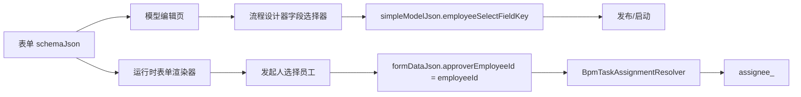

# BPM P3.1c 发起时自选审批人可用性补强设计

## 结论

P3.1c 推荐做 **字段选择器 + 运行时员工单选** 的最小闭环。

P3.1b 已经让 `EMPLOYEE_SELECT_AT_START` 能在启动流程前从 `formDataJson` 解析单个员工 ID。本轮不继续扩展会签、多实例、表达式或复杂候选人策略，而是把刚完成的能力从“手输字段 key 才能用”推进到“设计器可选字段、发起人可选员工、后端仍按单 ID 解析”。

## 当前证据

- 后端 `BpmDesignerDetailVO` 已包含 `formSchemaJson` 和 `formLayoutJson`。
- 前端 `BpmDesignerDetailRecord` 已声明 `formSchemaJson`。
- `model-editor.vue` 当前只展示 `formName`，没有把 `formSchemaJson` 传给 `BpmProcessDesignerAdapter`。
- `BpmProcessDesignerAdapter` 当前在 `EMPLOYEE_SELECT_AT_START` 下显示文本输入 `employeeSelectFieldKey`。
- `BpmRuntimeFormRenderer` 当前是薄的 form-create 渲染器，直接渲染后端表单 schema。
- 前端已有 `queryEmployeePage` 和 `EmployeeRecord`，待办转办/抄送弹窗已经复用员工分页接口。
- 后端 `BpmTaskAssignmentResolver` 已只接受单个员工 ID，并拒绝数组和逗号字符串。

## 目标

1. 设计流程时，选择 `发起时自选审批人` 后，可以从当前流程表单字段中选择审批人字段。
2. 发起流程时，审批人字段以员工单选方式填写，提交结果仍是单个 `employeeId`。
3. 后端继续复用 P3.1b 的 `employeeSelectFieldKey -> formDataJson -> assignee_<nodeKey>` 解析链路。
4. 不新增 SQL，不新增依赖，不迁移 Yudao/RuoYi 接口，不暴露 Flowable 原生对象。

## 非目标

- 不做多人审批、会签、或签、加签策略升级。
- 不做角色组、岗位、部门成员或多级主管候选人解析。
- 不做通用低代码字段类型平台。
- 不修改 BPM 表单数据库结构。
- 不新增员工选择后端接口，优先复用现有 `queryEmployeePage`。
- 不把 form-create 适配器改造成大型表单引擎封装。

## 方案比较

### 方案 A：继续保留手输字段 key

改动最小，但业务配置容易输错，发布前只能靠后端校验发现缺字段，无法让用户理解“该选哪个字段”。不推荐作为下一步。

### 方案 B：前端字段选择器 + 运行时员工单选

复用后端设计器详情里的 `formSchemaJson`，前端从表单 schema 解析字段候选项。流程设计器只保存字段 key；运行时表单把约定的员工字段渲染为员工单选，提交单个员工 ID。推荐。

### 方案 C：后端新增字段元数据接口

后端解析表单 schema 并返回字段摘要，前端只消费摘要。长期更规整，但当前已有 `formSchemaJson`，为 P3.1c 新增接口会扩大范围。暂不推荐。

## 推荐设计

采用方案 B。

### 设计器字段候选

在前端 BPM adapter 层增加一个轻量字段解析函数，从 `formSchemaJson` 中提取可作为审批人的字段：

- 字段 key 来源优先取 `field`。
- 字段标题优先取 `title`，没有时使用 `field`。
- 字段类型先接受明确员工语义的规则，例如 `type: "employeeSelect"`、`type: "employee"`、`component: "employeeSelect"` 或 `props.type: "employeeSelect"`。
- 为兼容当前表单设计器尚未内置员工组件的现实，可以临时接受字段名包含 `employeeId` 或 `approver` 的单值字段，但要在设计稿和测试里明确这是兼容兜底。

`BpmProcessDesignerAdapter` 新增 `form-schema-json` 入参，并把 `employeeSelectFieldKey` 的文本输入替换为下拉选择。没有候选字段时，保留一个禁用态提示，不自动生成字段。

### 模型编辑页传递表单 schema

`model-editor.vue` 在加载 `getBpmDesignerDetail` 后，保存 `detail.formSchemaJson` 到本地状态，并传给 `BpmProcessDesignerAdapter`。

这一步不改变后端接口，因为 `BpmDesignerDetailVO` 和前端 `BpmDesignerDetailRecord` 已经具备字段。

### 运行时员工单选

`BpmRuntimeFormRenderer` 在渲染前对 form-create rules 做一次轻量归一化：

- 识别员工单选字段规则。
- 将其渲染为 `ElSelect` 远程搜索员工。
- 选中值保持为单个数字员工 ID。
- 禁用多选，避免绕过后端单人审批边界。

员工查询复用 `queryEmployeePage({ keyword, disabledFlag: false, pageNum: 1, pageSize: 20 })`。

如果表单 schema 里只是普通输入框但字段 key 被流程节点绑定为 `employeeSelectFieldKey`，本轮不强行替换运行时控件；设计器应优先引导选择员工语义字段。

### 后端校验

P3.1b 已经校验 `employeeSelectFieldKey` 必填，并在运行时保证该字段只能解析为单个员工 ID。

P3.1c 不扩 `SimpleModelValidator` 签名，不新增后端字段存在性校验。原因是当前校验器只接收 `simpleModelJson` 和 `startRuleJson`，把表单 schema 引入后端校验会扩大本轮切片。字段存在性先由前端设计器合同保证，后端继续作为运行时单 ID 防线。

后端字段存在性校验可作为 P3.1d 单独切片：让发布校验自然拿到表单 schema，再验证 `employeeSelectFieldKey` 是否存在于当前模型关联表单。

## 数据流



## 测试策略

### 前端 RED 测试

- `bpm-designer-adapters.test.ts`：从 schema 中提取员工候选字段。
- `bpm-designer-adapters.test.ts`：`BpmProcessNodeDraft` 保留 `employeeSelectFieldKey`。
- `bpm-runtime-form-renderer` 相关测试：员工字段提交单个 `employeeId`。
- `bpm-modules.test.ts`：模型编辑页把 `formSchemaJson` 传给流程设计器。

### 后端 RED 测试

- 本轮不新增后端 production 逻辑。
- 复跑 P3.1b 已有 resolver/start/validator tests，证明前端可用性补强没有破坏后端单 ID 解析边界。

## 验证命令

```powershell
pnpm --dir E:/my-project/hunyuan-pro/hunyuan-design exec vitest run apps/hunyuan-system/src/components/bpm/adapters/bpm-designer-adapters.test.ts apps/hunyuan-system/src/views/system/bpm/bpm-modules.test.ts --dom
pnpm --dir E:/my-project/hunyuan-pro/hunyuan-design -F @hunyuan/system run typecheck
mvn -f E:/my-project/hunyuan-pro/hunyuan-backend/pom.xml -pl hunyuan-bpm '-Dtest=BpmTaskAssignmentResolverTest,SimpleModelValidatorTest,BpmRuntimeStartAssignmentTest' test
```

## 完成定义

- 流程设计器在 `EMPLOYEE_SELECT_AT_START` 下提供字段下拉，而不是只能手输。
- 字段候选来自当前模型关联表单的 `formSchemaJson`。
- 运行时表单能填写单个员工 ID。
- 提交后的 `formDataJson` 仍能被 P3.1b 解析为 `assignee_<nodeKey>`。
- 不新增 SQL，不新增依赖。
- 不扩大到多人审批或会签。

## 人工审阅重点

- 是否接受“字段存在性先由前端设计器保证，后端字段存在性校验延期到 P3.1d”的分层。
- 是否接受员工字段类型的约定名先用 `employeeSelect`。
- 是否接受字段名兜底识别只作为兼容，不作为长期标准。
